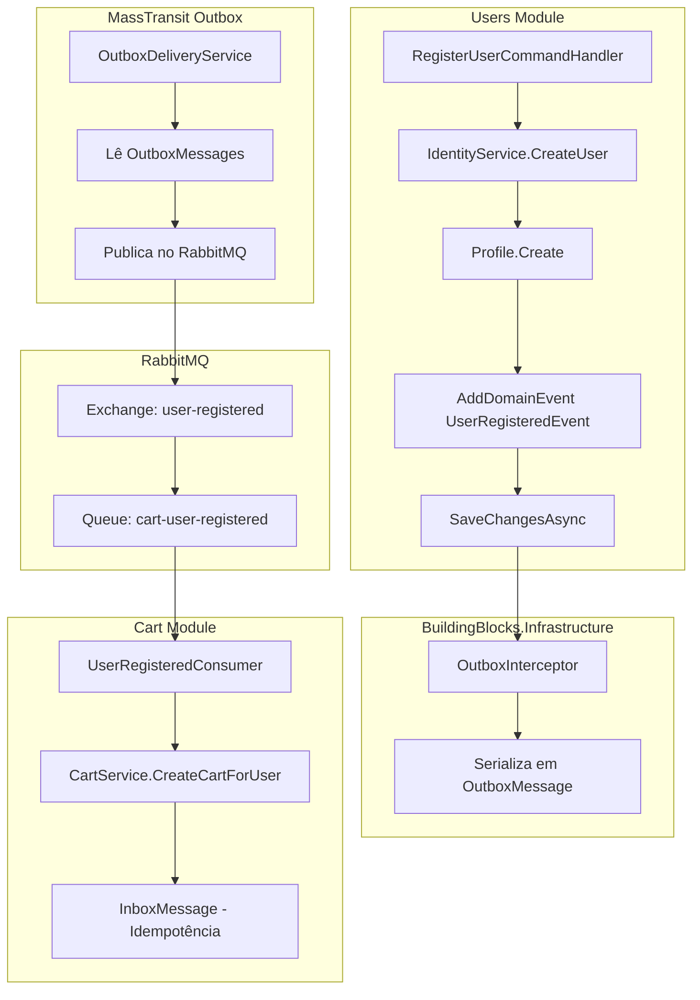

# Integração Entre Módulos COM RabbitMQ

Este documento descreve como implementar a integração entre os módulos **Users** e **Cart** utilizando **MassTransit + RabbitMQ** para comunicação assíncrona distribuída, com o padrão **Outbox** para garantir consistência.

## Cenário

1. Usuário é criado via ASP.NET Identity
2. Perfil do usuário é criado
3. Evento de integração `UserRegisteredIntegrationEvent` é disparado
4. RabbitMQ entrega o evento para o módulo Cart
5. Módulo Cart cria um carrinho para o usuário
6. **Módulos Users e Cart não se conhecem diretamente**

---

## Arquitetura



---

## Componentes Necessários

### 1. Evento de Integração (Shared/Contracts)

```csharp
// src/building-blocks/BuildingBlocks.Contracts/Events/UserRegisteredIntegrationEvent.cs
namespace BuildingBlocks.Contracts.Events;

/// <summary>
/// Evento de integração disparado quando um usuário é registrado.
/// Publicado via RabbitMQ para outros módulos consumirem.
/// </summary>
public record UserRegisteredIntegrationEvent
{
    public Guid EventId { get; init; } = Guid.NewGuid();
    public DateTime OccurredOn { get; init; } = DateTime.UtcNow;
    
    public Guid UserId { get; init; }
    public string Email { get; init; } = default!;
    public string? FirstName { get; init; }
    public string? LastName { get; init; }
    public DateTime RegisteredAt { get; init; }
}
```

---

## Implementação Passo a Passo

### Passo 1: Configurar MassTransit com RabbitMQ

```csharp
// src/building-blocks/BuildingBlocks.Messaging/DependencyInjection.cs
using BuildingBlocks.Messaging.Configuration;
using MassTransit;
using Microsoft.Extensions.Configuration;
using Microsoft.Extensions.DependencyInjection;

namespace BuildingBlocks.Messaging;

public static class DependencyInjection
{
    public static IServiceCollection AddMessagingServices(
        this IServiceCollection services,
        IConfiguration configuration,
        params Type[] consumerAssemblyMarkers)
    {
        var options = configuration
            .GetSection("Messaging")
            .Get<MessagingOptions>() ?? new MessagingOptions();

        services.AddMassTransit(busConfig =>
        {
            // Registra todos os consumers dos módulos
            foreach (var marker in consumerAssemblyMarkers)
            {
                busConfig.AddConsumers(marker.Assembly);
            }

            // Configura RabbitMQ
            busConfig.UsingRabbitMq((context, cfg) =>
            {
                cfg.Host(options.Host, options.VirtualHost, h =>
                {
                    h.Username(options.Username);
                    h.Password(options.Password);
                });

                // Configura retry e error handling
                cfg.UseMessageRetry(r => r.Intervals(
                    TimeSpan.FromSeconds(1),
                    TimeSpan.FromSeconds(5),
                    TimeSpan.FromSeconds(15),
                    TimeSpan.FromSeconds(30)
                ));

                // Configura endpoints automaticamente
                cfg.ConfigureEndpoints(context);
            });

            // Configura Outbox pattern com EF Core
            busConfig.AddEntityFrameworkOutbox<OutboxDbContext>(o =>
            {
                o.UsePostgres();
                o.UseBusOutbox();
                
                // Polling interval
                o.QueryDelay = TimeSpan.FromSeconds(1);
                
                // Cleanup de mensagens antigas
                o.DuplicateDetectionWindow = TimeSpan.FromMinutes(30);
            });
        });

        return services;
    }
}
```

### Passo 2: Opções de Configuração

```csharp
// src/building-blocks/BuildingBlocks.Messaging/Configuration/MessagingOptions.cs
namespace BuildingBlocks.Messaging.Configuration;

public class MessagingOptions
{
    public string Host { get; set; } = "localhost";
    public string VirtualHost { get; set; } = "/";
    public string Username { get; set; } = "guest";
    public string Password { get; set; } = "guest";
    
    /// <summary>
    /// Se true, usa RabbitMQ. Se false, usa InMemory (para dev/testes).
    /// </summary>
    public bool UseRabbitMq { get; set; } = true;
}
```

### Passo 3: appsettings.json

```json
{
  "Messaging": {
    "Host": "localhost",
    "VirtualHost": "/",
    "Username": "guest",
    "Password": "guest",
    "UseRabbitMq": true
  }
}
```

### Passo 4: Interface do Event Bus

```csharp
// src/building-blocks/BuildingBlocks.Messaging/Abstractions/IEventBus.cs
namespace BuildingBlocks.Messaging.Abstractions;

public interface IEventBus
{
    /// <summary>
    /// Publica um evento de integração.
    /// Com MassTransit Outbox, a mensagem é salva no banco e enviada após o commit.
    /// </summary>
    Task PublishAsync<TEvent>(TEvent @event, CancellationToken cancellationToken = default)
        where TEvent : class;
}
```

### Passo 5: Implementação do Event Bus com MassTransit

```csharp
// src/building-blocks/BuildingBlocks.Messaging/Implementation/MassTransitEventBus.cs
using BuildingBlocks.Messaging.Abstractions;
using MassTransit;

namespace BuildingBlocks.Messaging.Implementation;

public class MassTransitEventBus : IEventBus
{
    private readonly IPublishEndpoint _publishEndpoint;

    public MassTransitEventBus(IPublishEndpoint publishEndpoint)
    {
        _publishEndpoint = publishEndpoint;
    }

    public async Task PublishAsync<TEvent>(TEvent @event, CancellationToken cancellationToken = default)
        where TEvent : class
    {
        await _publishEndpoint.Publish(@event, cancellationToken);
    }
}
```

### Passo 6: Evento de Domínio no Módulo Users

```csharp
// src/modules/users/Users.Domain/Events/UserRegisteredDomainEvent.cs
using BuildingBlocks.Domain.Events;

namespace Users.Domain.Events;

public record UserRegisteredDomainEvent(
    Guid UserId,
    string Email,
    string? FirstName,
    string? LastName
) : DomainEvent;
```

### Passo 7: Handler que converte e publica via RabbitMQ

```csharp
// src/modules/users/Users.Application/EventHandlers/UserRegisteredDomainEventHandler.cs
using BuildingBlocks.Contracts.Events;
using BuildingBlocks.Messaging.Abstractions;
using MediatR;
using Users.Domain.Events;

namespace Users.Application.EventHandlers;

/// <summary>
/// Escuta o evento de domínio e publica evento de integração via RabbitMQ.
/// </summary>
public class UserRegisteredDomainEventHandler : INotificationHandler<UserRegisteredDomainEvent>
{
    private readonly IEventBus _eventBus;

    public UserRegisteredDomainEventHandler(IEventBus eventBus)
    {
        _eventBus = eventBus;
    }

    public async Task Handle(
        UserRegisteredDomainEvent notification, 
        CancellationToken cancellationToken)
    {
        var integrationEvent = new UserRegisteredIntegrationEvent
        {
            UserId = notification.UserId,
            Email = notification.Email,
            FirstName = notification.FirstName,
            LastName = notification.LastName,
            RegisteredAt = notification.OccurredOn
        };

        // O MassTransit Outbox garante que a mensagem será 
        // salva no banco antes do commit e enviada após
        await _eventBus.PublishAsync(integrationEvent, cancellationToken);
    }
}
```

### Passo 8: Consumer no Módulo Cart (MassTransit)

```csharp
// src/modules/cart/Cart.Application/Consumers/UserRegisteredConsumer.cs
using BuildingBlocks.Contracts.Events;
using Cart.Domain.Aggregates;
using Cart.Domain.Repositories;
using MassTransit;
using Microsoft.Extensions.Logging;

namespace Cart.Application.Consumers;

/// <summary>
/// Consumer MassTransit que escuta eventos de usuário registrado.
/// Cria automaticamente um carrinho para novos usuários.
/// </summary>
public class UserRegisteredConsumer : IConsumer<UserRegisteredIntegrationEvent>
{
    private readonly ICartRepository _cartRepository;
    private readonly ILogger<UserRegisteredConsumer> _logger;

    public UserRegisteredConsumer(
        ICartRepository cartRepository,
        ILogger<UserRegisteredConsumer> logger)
    {
        _cartRepository = cartRepository;
        _logger = logger;
    }

    public async Task Consume(ConsumeContext<UserRegisteredIntegrationEvent> context)
    {
        var message = context.Message;
        
        _logger.LogInformation(
            "Received UserRegisteredEvent for user {UserId} from RabbitMQ",
            message.UserId);

        // Idempotência: verifica se já existe carrinho
        var existingCart = await _cartRepository.GetByUserIdAsync(
            message.UserId, 
            context.CancellationToken);

        if (existingCart is not null)
        {
            _logger.LogWarning(
                "Cart already exists for user {UserId}, skipping",
                message.UserId);
            return;
        }

        // Cria o carrinho
        var cart = ShoppingCart.CreateForUser(message.UserId);
        
        await _cartRepository.AddAsync(cart, context.CancellationToken);
        await _cartRepository.UnitOfWork.SaveChangesAsync(context.CancellationToken);

        _logger.LogInformation(
            "Cart {CartId} created successfully for user {UserId}",
            cart.Id,
            message.UserId);
    }
}
```

### Passo 9: Configuração do Consumer com Inbox (Idempotência)

```csharp
// src/modules/cart/Cart.Infrastructure/DependencyInjection.cs
public static IServiceCollection AddCartInfrastructure(
    this IServiceCollection services,
    IConfiguration configuration)
{
    // ... outras configurações
    
    // Configura consumer com inbox para idempotência
    services.AddMassTransit(x =>
    {
        x.AddConsumer<UserRegisteredConsumer>();
        
        x.UsingRabbitMq((context, cfg) =>
        {
            cfg.ReceiveEndpoint("cart-user-registered", e =>
            {
                // Configura inbox para garantir processamento único
                e.UseInMemoryInboxOutbox(context);
                
                // Configura o consumer
                e.ConfigureConsumer<UserRegisteredConsumer>(context);
                
                // Retry policy
                e.UseMessageRetry(r => r.Intervals(
                    TimeSpan.FromSeconds(1),
                    TimeSpan.FromSeconds(5),
                    TimeSpan.FromSeconds(30)
                ));
            });
        });
    });
    
    return services;
}
```

---

## Estrutura de Dependências

```
┌─────────────────────────────────────────────────────────────┐
│                 BuildingBlocks.Contracts                     │
│       (Eventos de Integração - Records compartilhados)       │
└─────────────────────────────────────────────────────────────┘
                              ▲
                              │
         ┌────────────────────┼────────────────────┐
         │                    │                    │
         ▼                    │                    ▼
┌─────────────────┐           │           ┌─────────────────┐
│  Users.Domain   │           │           │   Cart.Domain   │
└────────┬────────┘           │           └────────┬────────┘
         │                    │                    │
         ▼                    │                    ▼
┌─────────────────┐           │           ┌─────────────────┐
│Users.Application│           │           │Cart.Application │
│  ┌───────────┐  │           │           │  ┌───────────┐  │
│  │ Handler   │──┼───────────┤           │  │ Consumer  │  │
│  │ (Publish) │  │           │           │  │ (Receive) │  │
│  └───────────┘  │           │           │  └───────────┘  │
└────────┬────────┘           │           └────────▲────────┘
         │                    │                    │
         │            ┌───────┴───────┐            │
         │            │               │            │
         ▼            ▼               ▼            │
    ┌─────────────────────────────────────────────┐
    │               RabbitMQ                       │
    │  ┌─────────────────┐  ┌──────────────────┐  │
    │  │ Exchange:       │  │ Queue:           │  │
    │  │ user-registered │──│ cart-user-       │──┼──────┘
    │  │                 │  │ registered       │  │
    │  └─────────────────┘  └──────────────────┘  │
    └─────────────────────────────────────────────┘

❌ Users NÃO referencia Cart
❌ Cart NÃO referencia Users  
✅ Ambos referenciam BuildingBlocks.Contracts
✅ RabbitMQ faz o roteamento
```

---

## Fluxo de Execução

```
1. [API] POST /api/users/register
      │
      ▼
2. [Users.Application] RegisterUserCommandHandler
      │
      ├── Cria usuário no Identity
      ├── Cria Profile (AggregateRoot)
      ├── Profile.AddDomainEvent(UserRegisteredDomainEvent)
      │
      ▼
3. [MediatR] Publica evento de domínio in-process
      │
      ▼
4. [Users.Application] UserRegisteredDomainEventHandler
      │
      ├── Converte para UserRegisteredIntegrationEvent
      ├── IEventBus.PublishAsync() → MassTransit Outbox
      │
      ▼
5. [MassTransit Outbox] Salva mensagem na tabela OutboxMessage
      │
      ▼
6. [Transaction COMMIT]
      │
      ▼
7. [MassTransit OutboxDeliveryService] Background Service
      │
      ├── Lê mensagens pendentes do Outbox
      ├── Envia para RabbitMQ
      ├── Marca como entregue
      │
      ▼
8. [RabbitMQ] Exchange recebe mensagem
      │
      ├── Roteia para queue "cart-user-registered"
      │
      ▼
9. [Cart.Application] UserRegisteredConsumer.Consume()
      │
      ├── Verifica idempotência (carrinho já existe?)
      ├── Cria ShoppingCart.CreateForUser(userId)
      ├── SaveChangesAsync()
      │
      ▼
10. [RabbitMQ] ACK - Mensagem confirmada
```

---

## Vantagens desta Abordagem

| Vantagem | Descrição |
|----------|-----------|
| **Escalabilidade** | Múltiplas instâncias podem consumir da mesma queue |
| **Resiliência** | RabbitMQ persiste mensagens em disco |
| **Desacoplamento** | Módulos completamente independentes |
| **Retry automático** | MassTransit gerencia retries e dead-letter |
| **Monitoramento** | RabbitMQ Management UI para visualizar filas |
| **Ordenação** | FIFO garantido por partition key |

---

## Desvantagens

| Desvantagem | Mitigação |
|-------------|-----------|
| **Complexidade** | Mais infraestrutura para gerenciar |
| **Latência** | Mensagem passa pelo broker (ms adicionais) |
| **Custo** | Requer servidor RabbitMQ (ou CloudAMQP) |
| **Debugging** | Rastrear mensagens é mais complexo |

---

## Configuração Docker Compose

```yaml
# docker-compose.yml
version: '3.8'

services:
  rabbitmq:
    image: rabbitmq:3-management-alpine
    container_name: bcommerce-rabbitmq
    ports:
      - "5672:5672"   # AMQP
      - "15672:15672" # Management UI
    environment:
      RABBITMQ_DEFAULT_USER: guest
      RABBITMQ_DEFAULT_PASS: guest
    volumes:
      - rabbitmq_data:/var/lib/rabbitmq
    healthcheck:
      test: rabbitmq-diagnostics -q ping
      interval: 30s
      timeout: 10s
      retries: 3

volumes:
  rabbitmq_data:
```

---

## Tabelas do Banco de Dados (MassTransit Outbox)

```sql
-- Criadas automaticamente pelo MassTransit EF Core Outbox

-- Outbox Messages (mensagens a serem enviadas)
CREATE TABLE "OutboxMessage" (
    "SequenceNumber" BIGSERIAL PRIMARY KEY,
    "MessageId" UUID NOT NULL,
    "ConversationId" UUID,
    "CorrelationId" UUID,
    "InitiatorId" UUID,
    "RequestId" UUID,
    "SourceAddress" TEXT,
    "DestinationAddress" TEXT,
    "ResponseAddress" TEXT,
    "FaultAddress" TEXT,
    "ExpirationTime" TIMESTAMPTZ,
    "SentTime" TIMESTAMPTZ NOT NULL,
    "ContentType" TEXT NOT NULL,
    "MessageType" TEXT NOT NULL,
    "Body" TEXT NOT NULL,
    "Headers" TEXT
);

-- Outbox State (rastreamento de envio)
CREATE TABLE "OutboxState" (
    "OutboxId" UUID PRIMARY KEY,
    "LockId" UUID NOT NULL,
    "RowVersion" BYTEA,
    "Created" TIMESTAMPTZ NOT NULL,
    "Delivered" TIMESTAMPTZ,
    "LastSequenceNumber" BIGINT
);

-- Inbox State (idempotência de consumo)
CREATE TABLE "InboxState" (
    "Id" BIGSERIAL PRIMARY KEY,
    "MessageId" UUID NOT NULL,
    "ConsumerId" UUID NOT NULL,
    "LockId" UUID NOT NULL,
    "RowVersion" BYTEA,
    "Received" TIMESTAMPTZ NOT NULL,
    "ReceiveCount" INT NOT NULL,
    "ExpirationTime" TIMESTAMPTZ,
    "Consumed" TIMESTAMPTZ,
    "Delivered" TIMESTAMPTZ,
    "LastSequenceNumber" BIGINT,
    UNIQUE ("MessageId", "ConsumerId")
);
```

---

## Monitoramento

### RabbitMQ Management UI
Acesse `http://localhost:15672` com usuário `guest` / senha `guest`.

### Métricas importantes:
- **Messages Ready**: Mensagens aguardando processamento
- **Messages Unacked**: Mensagens em processamento
- **Publish Rate**: Taxa de publicação
- **Deliver Rate**: Taxa de consumo

---

## Comparação: SEM vs COM RabbitMQ

| Aspecto | SEM RabbitMQ | COM RabbitMQ |
|---------|--------------|--------------|
| **Complexidade** | Baixa | Média-Alta |
| **Infraestrutura** | Apenas banco de dados | Banco + RabbitMQ |
| **Escalabilidade** | Single process | Multi-instance |
| **Latência** | 1-5 segundos (polling) | Milissegundos |
| **Resiliência** | Boa | Excelente |
| **Custo** | Menor | Maior |
| **Dev/Testes** | ✅ Ideal | ⚠️ Requer Docker |
| **Produção** | ⚠️ Limitado | ✅ Recomendado |

---

## Recomendação

1. **Desenvolvimento Local**: Use `InMemoryEventBus` (sem RabbitMQ)
2. **Staging/Production**: Use MassTransit + RabbitMQ
3. **Testes de Integração**: Use MassTransit Test Harness

```csharp
// Alternar entre implementações via configuração
if (options.UseRabbitMq)
{
    services.AddScoped<IEventBus, MassTransitEventBus>();
    // ... configuração RabbitMQ
}
else
{
    services.AddScoped<IEventBus, InMemoryEventBus>();
}
```
