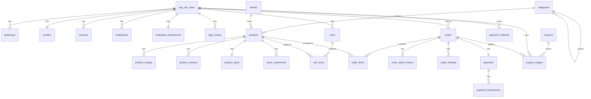

# Database ERD

Entity Relationship Diagram do banco de dados BCommerce.

## Schemas

```
PostgreSQL Database: bcommerce
├── users     # Usuários e autenticação
├── catalog   # Produtos e categorias
├── cart      # Carrinho de compras
├── orders    # Pedidos
├── payments  # Pagamentos
├── coupons   # Cupons e promoções
└── shared    # Outbox, audit log
```

## ERD Principal



## Tabelas por Schema

### users (ASP.NET Identity + Custom)

| Tabela | Descrição |
|--------|-----------|
| `asp_net_users` | Usuários (Identity) |
| `asp_net_roles` | Roles |
| `asp_net_user_roles` | User-Role mapping |
| `profiles` | Perfil estendido |
| `addresses` | Endereços |
| `sessions` | Sessões ativas |
| `notifications` | Notificações |
| `notification_preferences` | Preferências |
| `login_history` | Histórico de login |

### catalog

| Tabela | Descrição |
|--------|-----------|
| `categories` | Categorias (hierárquica) |
| `brands` | Marcas |
| `products` | Produtos |
| `product_images` | Imagens |
| `product_reviews` | Avaliações |
| `product_stock` | Estoque |
| `stock_movements` | Movimentações |

### cart

| Tabela | Descrição |
|--------|-----------|
| `carts` | Carrinhos |
| `cart_items` | Itens do carrinho |

### orders

| Tabela | Descrição |
|--------|-----------|
| `orders` | Pedidos |
| `order_items` | Itens do pedido |
| `order_status_history` | Histórico de status |
| `order_tracking` | Rastreamento |

### payments

| Tabela | Descrição |
|--------|-----------|
| `payments` | Pagamentos |
| `payment_transactions` | Transações |
| `payment_methods` | Métodos salvos |

### coupons

| Tabela | Descrição |
|--------|-----------|
| `coupons` | Cupons |
| `coupon_rules` | Regras |
| `coupon_usages` | Uso de cupons |

### shared

| Tabela | Descrição |
|--------|-----------|
| `domain_events` | Outbox/Inbox |
| `audit_log` | Audit trail |

## Foreign Keys Cross-Schema

```sql
-- Orders → Users
orders.user_id → users.asp_net_users.id

-- Orders → Products
order_items.product_id → catalog.products.id

-- Payments → Orders
payments.order_id → orders.orders.id

-- Cart → Users
carts.user_id → users.asp_net_users.id

-- Cart → Products  
cart_items.product_id → catalog.products.id
```

Veja [schema.sql](../db/schema.sql) para definição completa.
