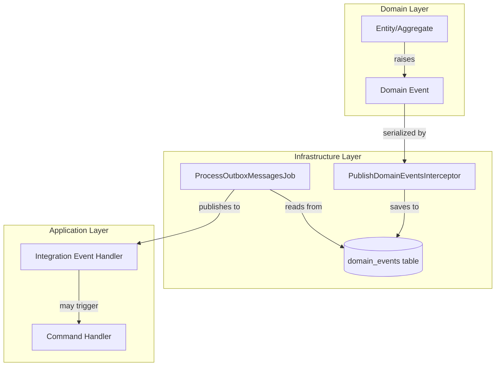
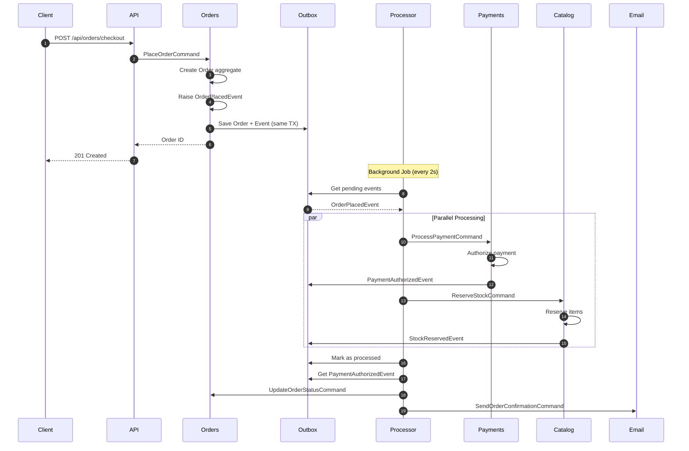

# Event Flow Diagram

Diagrama de fluxo de eventos no sistema BCommerce.

## Visão Geral



## Fluxo Detalhado: Order Checkout



## Tipos de Eventos

### Domain Events (Internos ao Aggregate)

| Evento | Aggregate | Descrição |
|--------|-----------|-----------|
| `OrderCreated` | Order | Pedido criado |
| `OrderItemAdded` | Order | Item adicionado |
| `OrderStatusChanged` | Order | Status alterado |
| `ProductCreated` | Product | Produto criado |
| `StockUpdated` | Product | Estoque atualizado |

### Integration Events (Entre Módulos)

| Evento | Producer | Consumers | Descrição |
|--------|----------|-----------|-----------|
| `OrderPlaced` | Orders | Payments, Catalog, Coupons | Pedido finalizado |
| `PaymentConfirmed` | Payments | Orders | Pagamento aprovado |
| `PaymentFailed` | Payments | Orders | Pagamento falhou |
| `StockReserved` | Catalog | Orders | Estoque reservado |
| `StockReleased` | Catalog | Orders | Estoque liberado |
| `UserRegistered` | Users | Catalog, Coupons | Novo usuário |

## Outbox Pattern Flow

```
1. Handler executa Command
   ↓
2. Aggregate levanta Domain Event via RaiseDomainEvent()
   ↓
3. SaveChangesAsync() é chamado
   ↓
4. PublishDomainEventsInterceptor intercepta
   ↓
5. Serializa eventos para domain_events table
   ↓
6. Commit da transação (Entity + Events atômico)
   ↓
7. ProcessOutboxMessagesJob (background)
   ↓
8. Lê eventos pendentes (processed_at IS NULL)
   ↓
9. Deserializa e publica para handlers registrados
   ↓
10. Marca como processado ou incrementa retry_count
```

## Garantias

| Garantia | Implementação |
|----------|---------------|
| **At-least-once delivery** | Retry com backoff |
| **Ordering** | Por aggregate_id |
| **Idempotency** | Handlers devem ser idempotentes |
| **Durability** | Eventos persistidos em DB |
