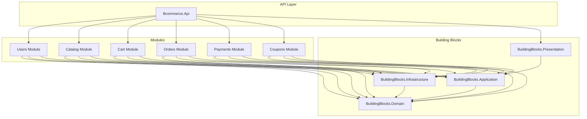
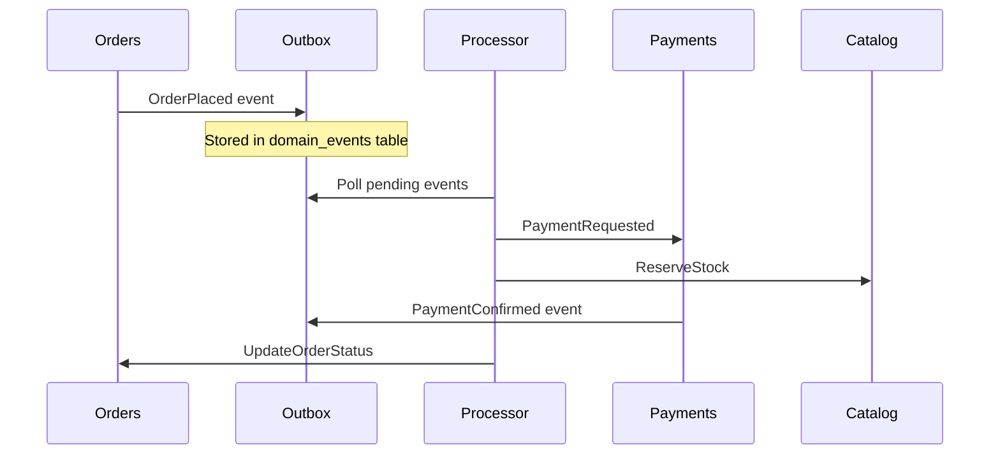

# Module Dependencies Diagram

Diagrama de dependências entre os módulos do BCommerce.

## Regras de Dependência

1. **Módulos NÃO dependem diretamente uns dos outros**
2. **Todos os módulos dependem apenas de BuildingBlocks**
3. **Comunicação entre módulos é feita via Integration Events**

## Diagrama de Dependências

## Comunicação via Events

## Matrix de Dependências

| Módulo | Domain | App | Infra | Presentation |
|--------|--------|-----|-------|--------------|
| Users | ✅ | ✅ | ✅ | ❌ |
| Catalog | ✅ | ✅ | ✅ | ❌ |
| Cart | ✅ | ✅ | ✅ | ❌ |
| Orders | ✅ | ✅ | ✅ | ❌ |
| Payments | ✅ | ✅ | ✅ | ❌ |
| Coupons | ✅ | ✅ | ✅ | ❌ |
| API | ❌ | ✅ | ✅ | ✅ |

## Integration Events

| Evento | Produtor | Consumidores |
|--------|----------|--------------|
| `UserRegistered` | Users | Catalog, Coupons |
| `OrderPlaced` | Orders | Payments, Catalog, Coupons |
| `PaymentConfirmed` | Payments | Orders |
| `PaymentFailed` | Payments | Orders |
| `StockReserved` | Catalog | Orders |
| `StockReleased` | Catalog | Orders, Cart |
| `CouponApplied` | Coupons | Orders |
