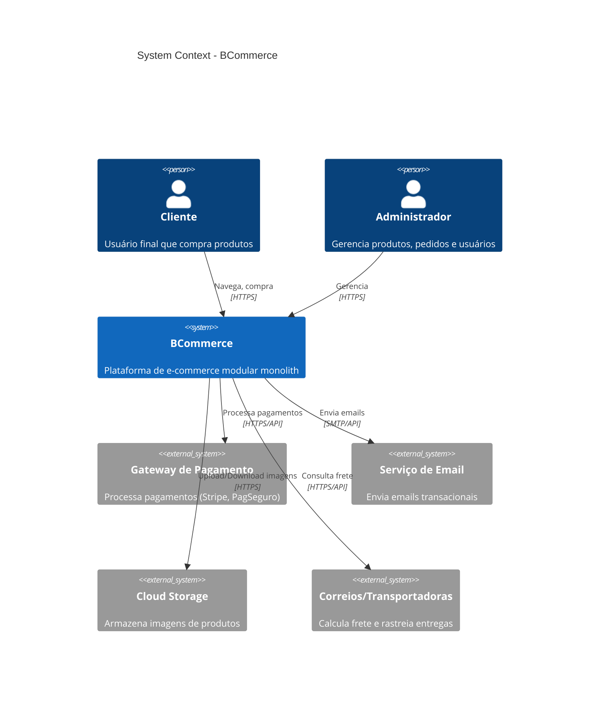

# System Context Diagram

Visão de alto nível do sistema BCommerce e suas integrações externas.

## Diagrama C4 - System Context



## Diagrama Simplificado

```
┌─────────────┐     ┌─────────────┐
│   Cliente   │     │    Admin    │
│   (Web)     │     │    (Web)    │
└──────┬──────┘     └──────┬──────┘
       │                   │
       ▼                   ▼
┌──────────────────────────────────┐
│                                  │
│           BCommerce API          │
│     (Modular Monolith .NET 8)    │
│                                  │
├──────────────────────────────────┤
│  Users │ Catalog │ Cart │ Orders │
│ Payments │ Coupons │ Shared      │
└──────────────────────────────────┘
       │
       ▼
┌──────────────────────────────────┐
│         PostgreSQL               │
│   (Schemas por módulo)           │
└──────────────────────────────────┘
       │
       ├──────────────────────────────┐
       ▼                              ▼
┌──────────────┐              ┌──────────────┐
│   Payment    │              │    Email     │
│   Gateway    │              │   Service    │
└──────────────┘              └──────────────┘
```

## Atores

| Ator | Descrição | Interações |
|------|-----------|------------|
| **Cliente** | Usuário final | Navegar catálogo, adicionar ao carrinho, finalizar compra |
| **Administrador** | Staff interno | Gerenciar produtos, processar pedidos, relatórios |

## Sistemas Externos

| Sistema | Propósito | Protocolo |
|---------|-----------|-----------|
| **Payment Gateway** | Processar transações | REST API |
| **Email Service** | Notificações transacionais | SMTP/API |
| **Cloud Storage** | Imagens de produtos | S3-compatible |
| **Shipping API** | Cálculo de frete e tracking | REST API |
