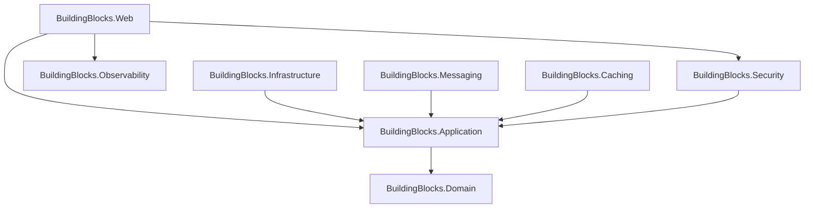

# Estrutura do Building Blocks - Separada por Responsabilidades

Este documento define a estrutura padronizada dos projetos **BuildingBlocks** (Shared Kernel), segregados por responsabilidades para melhor modularização e gerenciamento de dependências.

Cada seção abaixo representa um projeto Class Library (`.csproj`) separado.

## 1. BuildingBlocks.Domain
Contém as abstrações puras do DDD. **Não deve ter dependências externas** (apenas .NET Standard/Core).

```text
BuildingBlocks.Domain/
├── Models/
│   ├── AggregateRoot.cs                # Classe base com gerenciamento de eventos de domínio
│   ├── Entity.cs                       # Classe base com ID e Equality
│   ├── ValueObject.cs                  # Classe base para objetos de valor
│   ├── Enumeration.cs                  # Classe base para Smart Enums
│   └── IAggregateRoot.cs               # Interface marcadora
├── Events/
│   └── IDomainEvent.cs                 # Interface para eventos de domínio (INotification)
├── Repositories/
│   └── IRepository.cs                  # Interface genérica de repositório
├── Rules/
│   ├── IBusinessRule.cs                # Interface para regras de negócio
│   └── BusinessRuleValidationException.cs
└── Exceptions/
    ├── DomainException.cs              # Exceção base de domínio
    └── NotFoundException.cs            # Exceção para recursos não encontrados
```

## 2. BuildingBlocks.Application
Contém abstrações de aplicação, CQRS e Pipelines. Depende de `BuildingBlocks.Domain`.
**Pacotes:** `MediatR`, `FluentValidation`.

```text
BuildingBlocks.Application/
├── DependencyInjection.cs          # Extensão IServiceCollection (AddApplicationServices)
├── CQRS/
│   ├── ICommand.cs                     # Interface para Comandos
│   ├── ICommandHandler.cs              # Handler de Comandos
│   ├── IQuery.cs                       # Interface para Queries
│   └── IQueryHandler.cs                # Handler de Queries
├── Behaviors/
│   ├── ValidationBehavior.cs           # Pipeline de validação automática
│   ├── LoggingBehavior.cs              # Pipeline de log de requests
│   └── TransactionBehavior.cs          # Pipeline de transação (Unit of Work)
├── Models/
│   ├── Result.cs                       # Padrão Result (Sucesso/Falha) - Railway Oriented Programming
│   └── Error.cs                        # Objeto de erro padronizado
├── Pagination/
│   ├── IPaginatedResult.cs
│   └── PagedList.cs
├── DTOs/
│   └── ErrorDto.cs
└── Interfaces/
    └── IDateTimeProvider.cs            # Abstração de data (para testes)
```

## 3. BuildingBlocks.Infrastructure
Implementação de persistência e serviços de infraestrutura. Depende de `BuildingBlocks.Application`.
**Pacotes:** `Microsoft.EntityFrameworkCore`, `Npgsql` (Postgres).

```text
BuildingBlocks.Infrastructure/
├── DependencyInjection.cs          # Extensão IServiceCollection (AddInfrastructureServices)
├── Persistence/
│   ├── BaseDbContext.cs                # DbContext base com configurações comuns
│   ├── EfRepository.cs                 # Implementação genérica de repositório
│   ├── Configurations/                 # Mapeamentos globais
│   ├── Outbox/
│   │   ├── OutboxMessage.cs            # Entidade para tabela shared.domain_events
│   │   └── OutboxConfiguration.cs      # Mapeamento EF Core
│   ├── Inbox/
│   │   ├── InboxMessage.cs             # Entidade para tabela shared.processed_events
│   │   └── InboxConfiguration.cs       # Mapeamento EF Core
│   └── Interceptors/
│       ├── AuditInterceptor.cs         # Preenche CreatedAt, UpdatedAt, User
│       ├── OutboxInterceptor.cs        # Intercepta save changes e converte eventos em OutboxMessages
│       └── InboxInterceptor.cs         # Garante idempotência verificando mensagens já processadas
└── Services/
    └── DateTimeProvider.cs             # Implementação real de data
```

## 4. BuildingBlocks.Messaging
Abstrações e implementações de mensageria assíncrona (Event Bus). Depende de `BuildingBlocks.Application`.
**Pacotes:** `MassTransit` (ou similar).

```text
BuildingBlocks.Messaging/
├── DependencyInjection.cs          # Extensão IServiceCollection (AddMessagingServices)
├── Abstractions/
│   ├── IEventBus.cs                    # Interface para publicar/assinar
│   └── IIntegrationEvent.cs            # Interface marcadora para eventos entre módulos
├── Implementation/
│   ├── MasstransitEventBus.cs          # Implementação com MassTransit
│   └── InMemoryEventBus.cs             # Implementação para testes/dev
└── Configuration/
    └── MessagingOptions.cs             # Configurações de Broker (RabbitMQ)
```

## 5. BuildingBlocks.Security
Utilitários de segurança, autenticação e autorização.
**Pacotes:** `Microsoft.AspNetCore.Authentication.JwtBearer`.

```text
BuildingBlocks.Security/
├── DependencyInjection.cs          # Extensão IServiceCollection (AddSecurityServices)
├── Services/
│   └── ICurrentUser.cs                 # Interface para obter usuário logado (Claims)
├── Jwt/
│   ├── JwtOptions.cs
│   └── JwtExtensions.cs                # Extensões para configurar JWT
└── Authorization/
    ├── HasScopeRequirement.cs
    └── ClaimsPrincipalExtensions.cs    # Helpers para ler Claims
```

## 6. BuildingBlocks.Caching
Abstrações e implementações de Cache Distribuído. Depende de `BuildingBlocks.Application`.
**Pacotes:** `Microsoft.Extensions.Caching.StackExchangeRedis`.

```text
BuildingBlocks.Caching/
├── DependencyInjection.cs          # Extensão IServiceCollection (AddCachingServices)
├── Services/
│   └── ICacheService.cs                # Interface simplificada de cache
├── Implementations/
│   ├── RedisCacheService.cs            # Implementação Redis
│   └── InMemoryCacheService.cs         # Implementação MemoryCache
└── Behaviors/
    └── CachingBehavior.cs              # Pipeline para cache de Queries (IPipelineBehavior)
```

## 7. BuildingBlocks.Observability
Configuração centralizada de Logs, Métricas e Tracing (OpenTelemetry).
**Pacotes:** `OpenTelemetry`, `Serilog`.

```text
BuildingBlocks.Observability/
├── DependencyInjection.cs          # Configuração do OpenTelemetry (Logs, Metrics, Tracing)
├── Options/
│   └── ObservabilityOptions.cs         # Configuração via appsettings (OtlpEndpoint)
└── Diagnostics/
    └── ServiceDiagnostics.cs           # Definição de ActivitySource e Meter
```

## 8. BuildingBlocks.Web
Utilitários para a camada de apresentação (API). Depende de `BuildingBlocks.Application` e `BuildingBlocks.Security`.
**Pacotes:** `Microsoft.AspNetCore.Mvc`.

```text
BuildingBlocks.Web/
├── DependencyInjection.cs          # Extensão IServiceCollection (AddWebServices)
├── Controllers/
│   └── ApiControllerBase.cs            # Controller base com respostas padrão (Ok, BadRequest)
├── Middlewares/
│   └── GlobalExceptionHandler.cs       # Middleware de tratamento de erro (RFC 7807)
├── Filters/
│   └── ValidationFilter.cs             # Filtro opcional se não usar Behavior
└── Extensions/
    └── SwaggerExtensions.cs            # Configuração padronizada do Swagger
```

---

## Fluxo de Dependências


