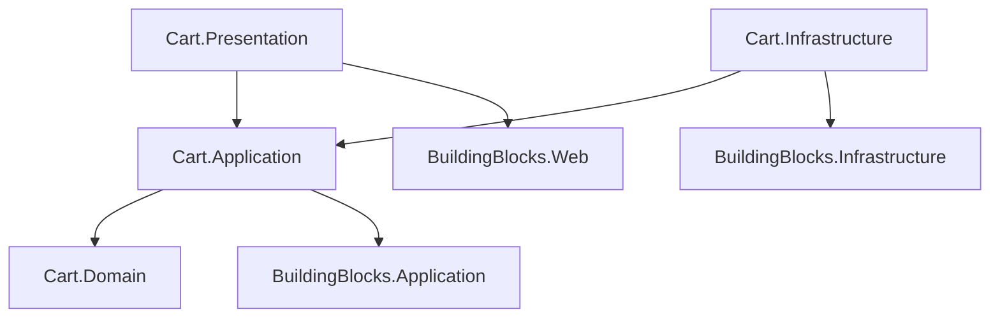

# Estrutura do Módulo Cart (Monolito Modular)

Este documento define a estrutura completa de pastas e arquivos para o módulo `Cart`, alinhada com os `BuildingBlocks` e o `schema.sql`.

## 1. Cart.Domain
Contém a lógica central do carrinho de compras, focada na gestão de itens e estado do carrinho.

```text
Cart.Domain/
├── Carts/
│   ├── Cart.cs                     # Aggregate Root (Tabela: cart.carts)
│   ├── CartItem.cs                 # Entidade (Tabela: cart.items)
│   ├── CartStatus.cs               # Enum (ACTIVE, MERGED, etc.)
│   ├── ICartRepository.cs          # Interface de Repositório
│   └── Events/
│       ├── CartCreatedDomainEvent.cs
│       ├── CartCheckedOutDomainEvent.cs
│       └── CartItemAddedDomainEvent.cs
├── SavedCarts/
│   ├── SavedCart.cs                # Entidade (Tabela: cart.saved_carts)
│   └── ISavedCartRepository.cs
└── Activity/
    ├── CartActivityLog.cs          # Entidade (Tabela: cart.activity_log)
    └── ICartActivityLogRepository.cs
```

## 2. Cart.Application
Implementação de casos de uso para manipulação do carrinho.

```text
Cart.Application/
├── DependencyInjection.cs          # Registro de serviços
├── Carts/
│   ├── Commands/
│   │   ├── CreateCart/
│   │   │   ├── CreateCartCommand.cs
│   │   │   └── CreateCartCommandHandler.cs
│   │   ├── AddItem/
│   │   │   ├── AddItemCommand.cs
│   │   │   ├── AddItemCommandHandler.cs
│   │   │   └── AddItemCommandValidator.cs
│   │   ├── RemoveItem/
│   │   │   ├── RemoveItemCommand.cs
│   │   │   └── RemoveItemCommandHandler.cs
│   │   ├── UpdateItemQuantity/
│   │   │   ├── UpdateItemQuantityCommand.cs
│   │   │   └── UpdateItemQuantityCommandHandler.cs
│   │   └── Checkout/
│   │       ├── CheckoutCommand.cs          # Inicia o processo de pedido
│   │       └── CheckoutCommandHandler.cs
│   └── Queries/
│       ├── GetCart/
│       │   ├── GetCartQuery.cs
│       │   ├── GetCartQueryHandler.cs
│       │   └── CartDto.cs
│       └── GetCartSummary/
│           ├── GetCartSummaryQuery.cs
│           └── CartSummaryDto.cs
└── EventHandlers/
    ├── ProductPriceChangedEventHandler.cs  # Atualiza preços no carrinho (se necessário)
    └── UserRegisteredEventHandler.cs       # Cria carrinho inicial (se aplicável)
```

## 3. Cart.Infrastructure
Persistência e comunicação com outros serviços (ex: Redis para cache de carrinho, se usado).

```text
Cart.Infrastructure/
├── DependencyInjection.cs
├── Persistence/
│   ├── CartDbContext.cs            # DbContext específico (Schema: cart)
│   ├── Repositories/
│   │   ├── CartRepository.cs
│   │   ├── SavedCartRepository.cs
│   │   └── CartActivityLogRepository.cs
│   ├── Configurations/             # Mapeamento EF Core
│   │   ├── CartConfiguration.cs
│   │   ├── CartItemConfiguration.cs
│   │   ├── SavedCartConfiguration.cs
│   │   └── CartActivityLogConfiguration.cs
│   └── Migrations/
└── Services/
    └── CartCleanerService.cs       # Background Job para limpar carrinhos expirados/abandonados
```

## 4. Cart.Presentation (ou Web)
API Endpoints.

```text
Cart.Presentation/
├── DependencyInjection.cs
├── Controllers/
│   ├── CartController.cs           # Adicionar/Remover itens, Checkout
│   └── SavedCartsController.cs     # Gestão de carrinhos salvos
└── Requests/
    ├── AddItemRequest.cs
    ├── UpdateItemQuantityRequest.cs
    └── CheckoutRequest.cs
```

---

## Fluxo de Dependências


