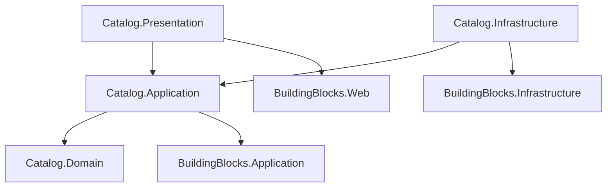

# Estrutura do Módulo Catalog (Monolito Modular)

Este documento define a estrutura completa de pastas e arquivos para o módulo `Catalog`, alinhada com os `BuildingBlocks` e o `schema.sql`.

## 1. Catalog.Domain
Contém as entidades, agregados e regras de negócio do catálogo de produtos.

```text
Catalog.Domain/
├── Products/
│   ├── Product.cs                  # Aggregate Root (Tabela: catalog.products)
│   ├── ProductImage.cs             # Entidade (Tabela: catalog.product_images)
│   ├── ProductStatus.cs            # Enum (Smart Enum ou Enum simples)
│   ├── IProductRepository.cs       # Interface de Repositório
│   └── Events/
│       ├── ProductCreatedDomainEvent.cs
│       ├── ProductPriceChangedDomainEvent.cs
│       └── ProductStockChangedDomainEvent.cs
├── Categories/
│   ├── Category.cs                 # Entidade (Tabela: catalog.categories)
│   └── ICategoryRepository.cs
├── Brands/
│   ├── Brand.cs                    # Entidade (Tabela: catalog.brands)
│   └── IBrandRepository.cs
├── Stock/
│   ├── StockMovement.cs            # Entidade (Tabela: catalog.stock_movements)
│   ├── StockReservation.cs         # Entidade (Tabela: catalog.stock_reservations)
│   └── StockMovementType.cs        # Enum
└── Reviews/
    ├── ProductReview.cs            # Entidade (Tabela: catalog.product_reviews)
    └── IProductReviewRepository.cs
```

## 2. Catalog.Application
Implementação de casos de uso (Commands/Queries).

```text
Catalog.Application/
├── DependencyInjection.cs          # Registro de serviços
├── Products/
│   ├── Commands/
│   │   ├── CreateProduct/
│   │   │   ├── CreateProductCommand.cs
│   │   │   ├── CreateProductCommandHandler.cs
│   │   │   └── CreateProductCommandValidator.cs
│   │   ├── UpdateProduct/
│   │   │   ├── UpdateProductCommand.cs
│   │   │   ├── UpdateProductCommandHandler.cs
│   │   │   └── UpdateProductCommandValidator.cs
│   │   ├── UpdateStock/
│   │   │   ├── UpdateStockCommand.cs
│   │   │   └── UpdateStockCommandHandler.cs
│   │   └── AddProductImage/
│   │       ├── AddProductImageCommand.cs
│   │       └── AddProductImageCommandHandler.cs
│   └── Queries/
│       ├── GetProductById/
│       │   ├── GetProductByIdQuery.cs
│       │   ├── GetProductByIdQueryHandler.cs
│       │   └── ProductDto.cs
│       └── GetProducts/
│           ├── GetProductsQuery.cs         # Com paginação e filtros
│           └── GetProductsQueryHandler.cs
├── Categories/
│   ├── Commands/
│   │   └── CreateCategory/
│   │       ├── CreateCategoryCommand.cs
│   │       └── CreateCategoryCommandHandler.cs
│   └── Queries/
│       └── GetCategories/
│           ├── GetCategoriesQuery.cs
│           └── CategoryDto.cs
└── Reviews/
    ├── Commands/
    │   └── AddReview/
    │       ├── AddReviewCommand.cs
    │       └── AddReviewCommandHandler.cs
    └── Queries/
        └── GetProductReviews/
            └── GetProductReviewsQuery.cs
```

## 3. Catalog.Infrastructure
Implementação de persistência e serviços específicos.

```text
Catalog.Infrastructure/
├── DependencyInjection.cs
├── Persistence/
│   ├── CatalogDbContext.cs         # DbContext específico (Schema: catalog)
│   ├── Repositories/
│   │   ├── ProductRepository.cs
│   │   ├── CategoryRepository.cs
│   │   ├── BrandRepository.cs
│   │   └── ProductReviewRepository.cs
│   ├── Configurations/             # Mapeamento EF Core
│   │   ├── ProductConfiguration.cs
│   │   ├── ProductImageConfiguration.cs
│   │   ├── CategoryConfiguration.cs
│   │   ├── BrandConfiguration.cs
│   │   ├── StockMovementConfiguration.cs
│   │   └── ProductReviewConfiguration.cs
│   └── Migrations/
└── Services/
    └── StockService.cs             # Lógica complexa de reserva de estoque (se necessário)
```

## 4. Catalog.Presentation (ou Web)
API Endpoints.

```text
Catalog.Presentation/
├── DependencyInjection.cs
├── Controllers/
│   ├── ProductsController.cs       # CRUD Produtos, Imagens, Estoque
│   ├── CategoriesController.cs     # CRUD Categorias
│   ├── BrandsController.cs         # CRUD Marcas
│   └── ReviewsController.cs        # Avaliações
└── Requests/
    ├── CreateProductRequest.cs
    ├── UpdateProductRequest.cs
    └── AddReviewRequest.cs
```

---

## Fluxo de Dependências


