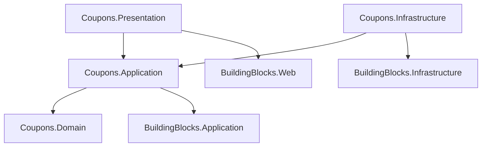

# Estrutura do Módulo Coupons (Monolito Modular)

Este documento define a estrutura completa de pastas e arquivos para o módulo `Coupons`, alinhada com os `BuildingBlocks` e o `schema.sql`.

## 1. Coupons.Domain
Contém a lógica de regras de desconto e validação de cupons.

```text
Coupons.Domain/
├── Coupons/
│   ├── Coupon.cs                   # Aggregate Root (Tabela: coupons.coupons)
│   ├── CouponType.cs               # Enum (PERCENTAGE, FIXED_AMOUNT, etc.)
│   ├── CouponStatus.cs             # Enum (ACTIVE, EXPIRED, etc.)
│   ├── ICouponRepository.cs        # Interface de Repositório
│   ├── Specifications/             # Specification Pattern para regras complexas
│   │   ├── CouponIsActiveSpec.cs
│   │   └── CouponIsEligibleForCartSpec.cs
│   └── Events/
│       ├── CouponCreatedDomainEvent.cs
│       ├── CouponUsedDomainEvent.cs
│       └── CouponDepletedDomainEvent.cs
├── Eligibilities/
│   ├── EligibleCategory.cs         # Entidade (Tabela: coupons.eligible_categories)
│   ├── EligibleProduct.cs          # Entidade (Tabela: coupons.eligible_products)
│   └── EligibleUser.cs             # Entidade (Tabela: coupons.eligible_users)
├── Usages/
│   ├── CouponUsage.cs              # Entidade (Tabela: coupons.usages)
│   └── ICouponUsageRepository.cs
└── Reservations/
    ├── CouponReservation.cs        # Entidade (Tabela: coupons.reservations)
    └── ICouponReservationRepository.cs
```

## 2. Coupons.Application
Implementação de casos de uso para gestão e aplicação de cupons.

```text
Coupons.Application/
├── DependencyInjection.cs          # Registro de serviços
├── Coupons/
│   ├── Commands/
│   │   ├── CreateCoupon/
│   │   │   ├── CreateCouponCommand.cs
│   │   │   ├── CreateCouponCommandHandler.cs
│   │   │   └── CreateCouponCommandValidator.cs
│   │   ├── UpdateCoupon/
│   │   │   ├── UpdateCouponCommand.cs
│   │   │   └── UpdateCouponCommandHandler.cs
│   │   ├── DeleteCoupon/
│   │   │   ├── DeleteCouponCommand.cs
│   │   │   └── DeleteCouponCommandHandler.cs
│   │   └── ApplyCoupon/
│   │       ├── ApplyCouponCommand.cs       # Valida e calcula desconto para um carrinho
│   │       ├── ApplyCouponCommandHandler.cs
│   │       └── ApplyCouponResult.cs        # Retorna valor do desconto e detalhes
│   └── Queries/
│       ├── GetCouponByCode/
│       │   ├── GetCouponByCodeQuery.cs
│       │   ├── GetCouponByCodeQueryHandler.cs
│       │   └── CouponDto.cs
│       └── ListCoupons/
│           ├── ListCouponsQuery.cs
│           └── ListCouponsQueryHandler.cs
└── EventHandlers/
    └── OrderPaidEventHandler.cs            # Confirma o uso do cupom (transforma reserva em uso real)
```

## 3. Coupons.Infrastructure
Persistência e serviços de domínio.

```text
Coupons.Infrastructure/
├── DependencyInjection.cs
├── Persistence/
│   ├── CouponsDbContext.cs         # DbContext específico (Schema: coupons)
│   ├── Repositories/
│   │   ├── CouponRepository.cs
│   │   ├── CouponUsageRepository.cs
│   │   └── CouponReservationRepository.cs
│   ├── Configurations/             # Mapeamento EF Core
│   │   ├── CouponConfiguration.cs
│   │   ├── EligibleCategoryConfiguration.cs
│   │   ├── EligibleProductConfiguration.cs
│   │   ├── EligibleUserConfiguration.cs
│   │   ├── CouponUsageConfiguration.cs
│   │   └── CouponReservationConfiguration.cs
│   └── Migrations/
└── Services/
    └── CouponValidatorService.cs   # Serviço para validações complexas (regras combinadas)
```

## 4. Coupons.Presentation (ou Web)
API Endpoints.

```text
Coupons.Presentation/
├── DependencyInjection.cs
├── Controllers/
│   ├── CouponsController.cs        # CRUD Admin
│   └── ValidationController.cs     # Endpoint público para validar cupom no checkout
└── Requests/
    ├── CreateCouponRequest.cs
    ├── UpdateCouponRequest.cs
    └── ApplyCouponRequest.cs       # Recebe itens do carrinho para simulação
```

---

## Fluxo de Dependências


