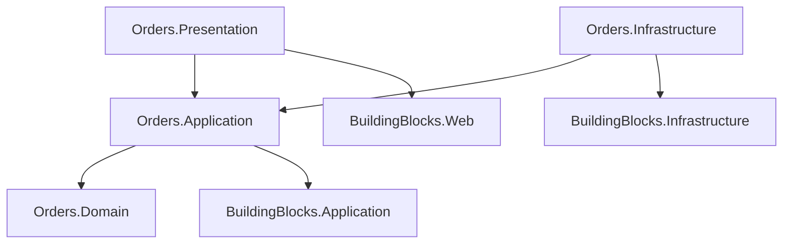

# Estrutura do Módulo Orders (Monolito Modular)

Este documento define a estrutura completa de pastas e arquivos para o módulo `Orders`, alinhada com os `BuildingBlocks` e o `schema.sql`.

## 1. Orders.Domain
Contém o agregado raiz de Pedido e todas as entidades relacionadas.

```text
Orders.Domain/
├── Orders/
│   ├── Order.cs                    # Aggregate Root (Tabela: orders.orders)
│   ├── OrderItem.cs                # Entidade (Tabela: orders.items)
│   ├── OrderStatus.cs              # Enum (PENDING, PAID, etc.)
│   ├── IOrderRepository.cs         # Interface de Repositório
│   ├── ValueObjects/
│   │   ├── OrderNumber.cs
│   │   ├── AddressSnapshot.cs      # Value Object para shipping/billing address
│   │   └── Money.cs
│   └── Events/
│       ├── OrderCreatedDomainEvent.cs
│       ├── OrderPaidDomainEvent.cs
│       ├── OrderShippedDomainEvent.cs
│       └── OrderCancelledDomainEvent.cs
├── Tracking/
│   ├── TrackingEvent.cs            # Entidade (Tabela: orders.tracking_events)
│   └── ITrackingRepository.cs
├── Invoices/
│   ├── Invoice.cs                  # Entidade (Tabela: orders.invoices)
│   └── IInvoiceRepository.cs
└── StatusHistory/
    ├── OrderStatusHistory.cs       # Entidade (Tabela: orders.status_history)
    └── IStatusHistoryRepository.cs
```

## 2. Orders.Application
Implementação de casos de uso para gestão de pedidos.

```text
Orders.Application/
├── DependencyInjection.cs          # Registro de serviços
├── Orders/
│   ├── Commands/
│   │   ├── CreateOrder/
│   │   │   ├── CreateOrderCommand.cs       # Criação do pedido a partir do Checkout
│   │   │   ├── CreateOrderCommandHandler.cs
│   │   │   └── CreateOrderCommandValidator.cs
│   │   ├── CancelOrder/
│   │   │   ├── CancelOrderCommand.cs
│   │   │   └── CancelOrderCommandHandler.cs
│   │   ├── MarkAsPaid/
│   │   │   ├── MarkAsPaidCommand.cs        # Chamado via Webhook de Pagamento
│   │   │   └── MarkAsPaidCommandHandler.cs
│   │   └── ShipOrder/
│   │       ├── ShipOrderCommand.cs
│   │       └── ShipOrderCommandHandler.cs
│   └── Queries/
│       ├── GetOrderById/
│       │   ├── GetOrderByIdQuery.cs
│       │   ├── GetOrderByIdQueryHandler.cs
│       │   └── OrderDto.cs
│       ├── GetUserOrders/
│       │   ├── GetUserOrdersQuery.cs
│       │   └── GetUserOrdersQueryHandler.cs
│       └── GetOrdersByStatus/        # Para Admin
│           ├── GetOrdersByStatusQuery.cs
│           └── GetOrdersByStatusQueryHandler.cs
├── Tracking/
│   ├── Commands/
│   │   └── AddTrackingEvent/
│   │       ├── AddTrackingEventCommand.cs
│   │       └── AddTrackingEventCommandHandler.cs
│   └── Queries/
│       └── GetOrderTracking/
│           └── GetOrderTrackingQuery.cs
└── EventHandlers/
    ├── PaymentApprovedEventHandler.cs      # Escuta evento de pagamento (Integração)
    └── CartCheckedOutEventHandler.cs       # Escuta evento de checkout (se assíncrono)
```

## 3. Orders.Infrastructure
Persistência e integrações externas.

```text
Orders.Infrastructure/
├── DependencyInjection.cs
├── Persistence/
│   ├── OrdersDbContext.cs          # DbContext específico (Schema: orders)
│   ├── Repositories/
│   │   ├── OrderRepository.cs
│   │   ├── TrackingRepository.cs
│   │   └── InvoiceRepository.cs
│   ├── Configurations/             # Mapeamento EF Core
│   │   ├── OrderConfiguration.cs
│   │   ├── OrderItemConfiguration.cs
│   │   ├── TrackingEventConfiguration.cs
│   │   ├── InvoiceConfiguration.cs
│   │   └── OrderStatusHistoryConfiguration.cs
│   └── Migrations/
└── Services/
    └── OrderNumberGenerator.cs     # Serviço para gerar números de pedido sequenciais (Sequence)
```

## 4. Orders.Presentation (ou Web)
API Endpoints.

```text
Orders.Presentation/
├── DependencyInjection.cs
├── Controllers/
│   ├── OrdersController.cs         # CRUD Pedidos (Cliente e Admin)
│   ├── TrackingController.cs       # Rastreamento
│   └── InvoicesController.cs       # Notas Fiscais
└── Requests/
    ├── CreateOrderRequest.cs
    ├── CancelOrderRequest.cs
    └── AddTrackingEventRequest.cs
```

---

## Fluxo de Dependências


