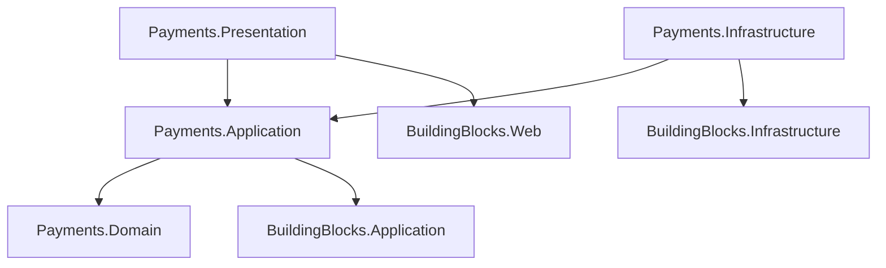

# Estrutura do Módulo Payments (Monolito Modular)

Este documento define a estrutura completa de pastas e arquivos para o módulo `Payments`, alinhada com os `BuildingBlocks` e o `schema.sql`.

## 1. Payments.Domain
Contém o agregado raiz de Pagamento, transações e métodos salvos.

```text
Payments.Domain/
├── Payments/
│   ├── Payment.cs                  # Aggregate Root (Tabela: payments.payments)
│   ├── Transaction.cs              # Entidade (Tabela: payments.transactions)
│   ├── PaymentStatus.cs            # Enum (PENDING, CAPTURED, FAILED)
│   ├── PaymentMethodType.cs        # Enum (CREDIT_CARD, PIX, BOLETO)
│   ├── IPaymentRepository.cs       # Interface de Repositório
│   └── Events/
│       ├── PaymentAuthorizedDomainEvent.cs
│       ├── PaymentCapturedDomainEvent.cs
│       ├── PaymentFailedDomainEvent.cs
│       └── PaymentRefundedDomainEvent.cs
├── UserMethods/
│   ├── UserPaymentMethod.cs        # Entidade (Tabela: payments.user_methods)
│   └── IUserPaymentMethodRepository.cs
├── Refunds/
│   ├── Refund.cs                   # Entidade (Tabela: payments.refunds)
│   └── IRefundRepository.cs
├── Chargebacks/
│   ├── Chargeback.cs               # Entidade (Tabela: payments.chargebacks)
│   └── IChargebackRepository.cs
└── Webhooks/
    ├── WebhookReceived.cs          # Entidade (Tabela: payments.webhooks)
    └── IWebhookRepository.cs
```

## 2. Payments.Application
Implementação de casos de uso para processamento de pagamentos e webhooks.

```text
Payments.Application/
├── DependencyInjection.cs          # Registro de serviços
├── Payments/
│   ├── Commands/
│   │   ├── ProcessPayment/
│   │   │   ├── ProcessPaymentCommand.cs       # Inicia o pagamento (via Checkout)
│   │   │   ├── ProcessPaymentCommandHandler.cs
│   │   │   └── ProcessPaymentCommandValidator.cs
│   │   ├── CancelPayment/
│   │   │   ├── CancelPaymentCommand.cs
│   │   │   └── CancelPaymentCommandHandler.cs
│   │   └── RefundPayment/
│   │       ├── RefundPaymentCommand.cs
│   │       └── RefundPaymentCommandHandler.cs
│   └── Queries/
│       ├── GetPaymentById/
│       │   ├── GetPaymentByIdQuery.cs
│       │   └── GetPaymentByIdQueryHandler.cs
│       └── GetUserPayments/
│           ├── GetUserPaymentsQuery.cs
│           └── GetUserPaymentsQueryHandler.cs
├── UserMethods/
│   ├── Commands/
│   │   ├── SavePaymentMethod/
│   │   │   ├── SavePaymentMethodCommand.cs
│   │   │   └── SavePaymentMethodCommandHandler.cs
│   │   └── DeletePaymentMethod/
│   │       ├── DeletePaymentMethodCommand.cs
│   │       └── DeletePaymentMethodCommandHandler.cs
│   └── Queries/
│       └── GetUserMethods/
│           ├── GetUserMethodsQuery.cs
│           └── GetUserMethodsQueryHandler.cs
├── Webhooks/
│   ├── Commands/
│   │   └── ProcessWebhook/
│   │       ├── ProcessWebhookCommand.cs       # Processa payload do Gateway
│   │       └── ProcessWebhookCommandHandler.cs
│   └── EventHandlers/
│       └── PaymentAuthorizedEventHandler.cs   # Reage a evento interno (se necessário)
└── EventHandlers/
    └── OrderCreatedEventHandler.cs            # Inicia pagamento quando pedido é criado (se síncrono)
```

## 3. Payments.Infrastructure
Persistência e Integração com Gateways de Pagamento (Stripe, Pagar.me, etc).

```text
Payments.Infrastructure/
├── DependencyInjection.cs
├── Persistence/
│   ├── PaymentsDbContext.cs        # DbContext específico (Schema: payments)
│   ├── Repositories/
│   │   ├── PaymentRepository.cs
│   │   ├── UserPaymentMethodRepository.cs
│   │   ├── RefundRepository.cs
│   │   ├── ChargebackRepository.cs
│   │   └── WebhookRepository.cs
│   ├── Configurations/             # Mapeamento EF Core
│   │   ├── PaymentConfiguration.cs
│   │   ├── TransactionConfiguration.cs
│   │   ├── UserPaymentMethodConfiguration.cs
│   │   ├── RefundConfiguration.cs
│   │   ├── ChargebackConfiguration.cs
│   │   └── WebhookConfiguration.cs
│   └── Migrations/
└── Gateways/                       # Implementações de Gateway (Adapter Pattern)
    ├── IPaymentGateway.cs          # Interface comum para gateways
    ├── Stripe/
    │   ├── StripeGateway.cs
    │   ├── StripeConfiguration.cs
    │   └── StripeMapper.cs
    └── PagarMe/                    # Exemplo de outro gateway
        ├── PagarMeGateway.cs
        └── PagarMeConfiguration.cs
```

## 4. Payments.Presentation (ou Web)
API Endpoints e Webhook Receivers.

```text
Payments.Presentation/
├── DependencyInjection.cs
├── Controllers/
│   ├── PaymentsController.cs       # Status do pagamento, Reembolsos
│   ├── MethodsController.cs        # Gestão de cartões salvos
│   └── WebhooksController.cs       # Endpoint público para receber notificações do Gateway
└── Requests/
    ├── SaveCreditCardRequest.cs
    ├── RefundRequest.cs
    └── WebhookRequest.cs           # Payload genérico ou específico
```

---

## Fluxo de Dependências


