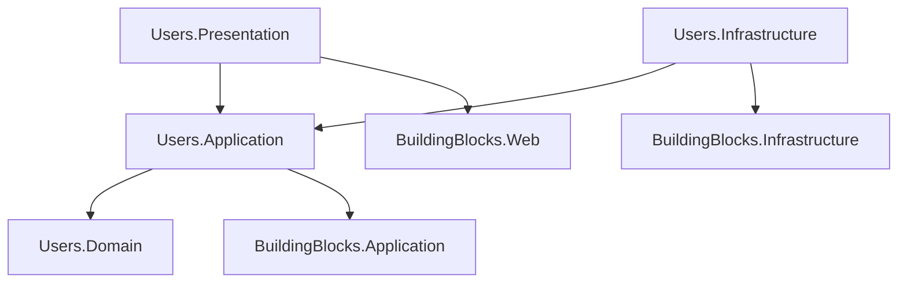

# Estrutura do Módulo Users (Monolito Modular)

Este documento define a estrutura completa de pastas e arquivos para o módulo `Users`, baseada na Clean Architecture e alinhada com os `BuildingBlocks` e o `schema.sql`.

## 1. Users.Domain
Contém as entidades, objetos de valor e regras de negócio específicas do módulo.

```text
Users.Domain/
├── Users/
│   ├── User.cs                     # Aggregate Root (wrapper sobre IdentityUser ou entidade custom)
│   ├── UserProfile.cs              # Entidade (Tabela: users.profiles)
│   ├── Address.cs                  # Entidade (Tabela: users.addresses)
│   ├── IUserRepository.cs          # Interface de Repositório
│   └── Events/
│       └── UserRegisteredDomainEvent.cs
├── Notifications/
│   ├── Notification.cs             # Entidade (Tabela: users.notifications)
│   ├── NotificationPreference.cs   # Entidade (Tabela: users.notification_preferences)
│   └── INotificationRepository.cs
└── Sessions/
    ├── Session.cs                  # Entidade (Tabela: users.sessions)
    └── ISessionRepository.cs
```

## 2. Users.Application
Contém os casos de uso (Commands/Queries), validações e mapeamentos.

```text
Users.Application/
├── DependencyInjection.cs          # Registro de serviços do módulo
├── Users/
│   ├── Commands/
│   │   ├── RegisterUser/
│   │   │   ├── RegisterUserCommand.cs
│   │   │   ├── RegisterUserCommandHandler.cs
│   │   │   └── RegisterUserCommandValidator.cs
│   │   ├── Login/
│   │   │   ├── LoginCommand.cs
│   │   │   ├── LoginCommandHandler.cs
│   │   │   └── LoginCommandValidator.cs
│   │   ├── UpdateProfile/
│   │   │   ├── UpdateProfileCommand.cs
│   │   │   ├── UpdateProfileCommandHandler.cs
│   │   │   └── UpdateProfileCommandValidator.cs
│   │   └── AddAddress/
│   │       ├── AddAddressCommand.cs
│   │       ├── AddAddressCommandHandler.cs
│   │       └── AddAddressCommandValidator.cs
│   └── Queries/
│       ├── GetUserProfile/
│       │   ├── GetUserProfileQuery.cs
│       │   ├── GetUserProfileQueryHandler.cs
│       │   └── UserProfileDto.cs
│       └── GetUserAddresses/
│           ├── GetUserAddressesQuery.cs
│           ├── GetUserAddressesQueryHandler.cs
│           └── AddressDto.cs
├── Notifications/
│   └── Commands/
│       └── MarkNotificationAsRead/
│           ├── MarkNotificationAsReadCommand.cs
│           └── MarkNotificationAsReadCommandHandler.cs
└── EventHandlers/                   # Handlers para eventos de integração ou domínio
    └── UserRegisteredEventHandler.cs
```

## 3. Users.Infrastructure
Implementação de persistência, integrações externas e serviços de infraestrutura.

```text
Users.Infrastructure/
├── DependencyInjection.cs          # Registro do DbContext e Repositórios
├── Persistence/
│   ├── UsersDbContext.cs           # DbContext específico do módulo (Schema: users)
│   ├── Repositories/
│   │   ├── UserRepository.cs
│   │   ├── NotificationRepository.cs
│   │   └── SessionRepository.cs
│   ├── Configurations/             # Entity Framework Configurations
│   │   ├── UserConfiguration.cs
│   │   ├── UserProfileConfiguration.cs
│   │   ├── AddressConfiguration.cs
│   │   ├── NotificationConfiguration.cs
│   │   └── SessionConfiguration.cs
│   └── Migrations/                 # Migrations específicas do módulo users
├── Identity/                       # Extensões do ASP.NET Core Identity
│   ├── ApplicationUser.cs          # Herda de IdentityUser<Guid>
│   ├── ApplicationRole.cs          # Herda de IdentityRole<Guid>
│   └── IdentityService.cs          # Serviço wrapper para UserManager/SignInManager
└── Services/
    └── EmailNotificationService.cs # Implementação de envio de e-mail
```

## 4. Users.Presentation (ou Web)
Controllers e Endpoints da API.

```text
Users.Presentation/
├── DependencyInjection.cs          # Registro dos Controllers (Assembly scanning)
├── Controllers/
│   ├── AuthController.cs           # Login, Refresh Token, Logout
│   ├── UsersController.cs          # Cadastro, Perfil
│   ├── AddressesController.cs      # CRUD de Endereços
│   └── NotificationsController.cs  # Listagem e Ações em Notificações
└── Requests/                       # DTOs de entrada (Body) se não usar Commands diretamente
    ├── RegisterUserRequest.cs
    ├── LoginRequest.cs
    ├── UpdateProfileRequest.cs
    └── CreateAddressRequest.cs
```

---

## Fluxo de Dependências do Módulo


