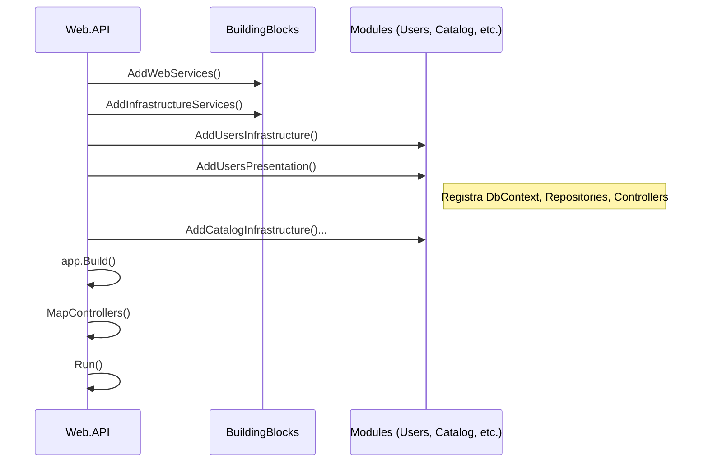

# Estrutura do Projeto API (Web.API)

Este documento define a estrutura do projeto principal da API (`Web.API`), que atua como o **Host** do Monolito Modular.

A responsabilidade deste projeto é **orquestrar a inicialização** de todos os módulos, carregar as configurações e expor os endpoints via Swagger/HTTP.

## Estrutura de Pastas

```text
Web.API/
├── appsettings.json                # Configurações gerais (Logging, AllowedHosts)
├── appsettings.Development.json    # Configurações de desenvolvimento
├── Program.cs                      # Ponto de entrada (Minimal Hosting Model)
├── Extensions/
│   ├── MigrationExtensions.cs      # Extension Method para aplicar migrations na inicialização
│   └── SerilogExtensions.cs        # Configuração de Log estruturado
├── Modules/                        # (Opcional) Se quiser registrar módulos manualmente aqui,
│                                   # mas o ideal é usar os DependencyInjection dos próprios módulos.
└── Properties/
    └── launchSettings.json         # Perfis de execução (IIS Express, Kestrel)
```

## Detalhes do `Program.cs`

O `Program.cs` é o coração do host. Ele deve referenciar e carregar cada módulo individualmente.

```csharp
using BuildingBlocks.Application;
using BuildingBlocks.Infrastructure;
using BuildingBlocks.Messaging;
using BuildingBlocks.Security;
using BuildingBlocks.Web;
using Users.Infrastructure;
using Users.Presentation;
using Catalog.Infrastructure;
using Catalog.Presentation;
using Cart.Infrastructure;
using Cart.Presentation;
using Orders.Infrastructure;
using Orders.Presentation;
using Payments.Infrastructure;
using Payments.Presentation;
using Coupons.Infrastructure;
using Coupons.Presentation;

var builder = WebApplication.CreateBuilder(args);

// 1. Configurar Building Blocks (Shared)
builder.Services.AddApplicationServices(builder.Configuration); // MediatR Behaviors, Validators
builder.Services.AddInfrastructureServices(builder.Configuration); // EF Core, Outbox/Inbox
builder.Services.AddMessagingServices(builder.Configuration); // MassTransit
builder.Services.AddSecurityServices(builder.Configuration); // JWT, Auth
builder.Services.AddWebServices(builder.Configuration); // Swagger, Middleware, Controllers

// 2. Registrar Módulos (Infrastructure + Presentation + Application via transitividade)
// Cada módulo expõe um método de extensão "Add{Module}Module" ou similar.

// Users
builder.Services.AddUsersInfrastructure(builder.Configuration);
builder.Services.AddUsersPresentation();

// Catalog
builder.Services.AddCatalogInfrastructure(builder.Configuration);
builder.Services.AddCatalogPresentation();

// Cart
builder.Services.AddCartInfrastructure(builder.Configuration);
builder.Services.AddCartPresentation();

// Orders
builder.Services.AddOrdersInfrastructure(builder.Configuration);
builder.Services.AddOrdersPresentation();

// Payments
builder.Services.AddPaymentsInfrastructure(builder.Configuration);
builder.Services.AddPaymentsPresentation();

// Coupons
builder.Services.AddCouponsInfrastructure(builder.Configuration);
builder.Services.AddCouponsPresentation();

var app = builder.Build();

// 3. Configurar Pipeline HTTP
if (app.Environment.IsDevelopment())
{
    app.UseSwagger();
    app.UseSwaggerUI();
}

app.UseHttpsRedirection();

// Middleware Global de Tratamento de Erro (BuildingBlocks.Web)
app.UseMiddleware<GlobalExceptionHandler>();

app.UseAuthentication();
app.UseAuthorization();

// Mapeia Controllers de todos os módulos (Presentation Assemblies)
app.MapControllers();

// 4. Executar Migrations (Opcional: Ideal é rodar em CI/CD ou Job separado)
await app.ApplyMigrationsAsync();

app.Run();
```

## Dependências do Projeto (`Web.API.csproj`)

Este projeto deve referenciar a camada de **Infrastructure** e **Presentation** de todos os módulos. A camada de **Application** e **Domain** será carregada transitivamente.
Application\BuildingBlocks.Application.csproj" />
    <ProjectReference Include="..\BuildingBlocks\BuildingBlocks.Infrastructure\BuildingBlocks.Infrastructure.csproj" />
    <ProjectReference Include="..\BuildingBlocks\BuildingBlocks.Messaging\BuildingBlocks.Messaging.csproj" />
    <ProjectReference Include="..\BuildingBlocks\BuildingBlocks.Security\BuildingBlocks.Security.csproj" />
    <ProjectReference Include="..\BuildingBlocks\BuildingBlocks.
```xml
<ItemGroup>
    <!-- Building Blocks -->
    <ProjectReference Include="..\BuildingBlocks\BuildingBlocks.Web\BuildingBlocks.Web.csproj" />
    
    <!-- Users -->
    <ProjectReference Include="..\Modules\Users\Users.Infrastructure\Users.Infrastructure.csproj" />
    <ProjectReference Include="..\Modules\Users\Users.Presentation\Users.Presentation.csproj" />

    <!-- Catalog -->
    <ProjectReference Include="..\Modules\Catalog\Catalog.Infrastructure\Catalog.Infrastructure.csproj" />
    <ProjectReference Include="..\Modules\Catalog\Catalog.Presentation\Catalog.Presentation.csproj" />

    <!-- Cart -->
    <ProjectReference Include="..\Modules\Cart\Cart.Infrastructure\Cart.Infrastructure.csproj" />
    <ProjectReference Include="..\Modules\Cart\Cart.Presentation\Cart.Presentation.csproj" />

    <!-- Orders -->
    <ProjectReference Include="..\Modules\Orders\Orders.Infrastructure\Orders.Infrastructure.csproj" />
    <ProjectReference Include="..\Modules\Orders\Orders.Presentation\Orders.Presentation.csproj" />

    <!-- Payments -->
    <ProjectReference Include="..\Modules\Payments\Payments.Infrastructure\Payments.Infrastructure.csproj" />
    <ProjectReference Include="..\Modules\Payments\Payments.Presentation\Payments.Presentation.csproj" />

    <!-- Coupons -->
    <ProjectReference Include="..\Modules\Coupons\Coupons.Infrastructure\Coupons.Infrastructure.csproj" />
    <ProjectReference Include="..\Modules\Coupons\Coupons.Presentation\Coupons.Presentation.csproj" />
</ItemGroup>
```

---

## Fluxo de Inicialização


