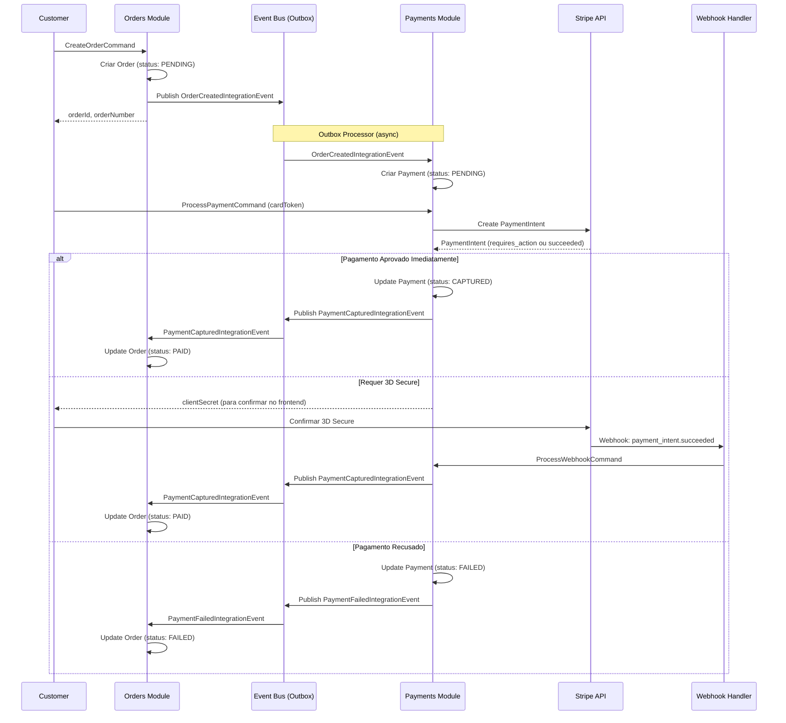

# Exemplo: Comunicação Orders → Payments (Stripe)

> Quando um pedido é criado, o módulo Payments processa o pagamento com cartão de crédito via Stripe.

---

## 🎯 Cenário

```
┌─────────────────┐                          ┌─────────────────┐                      ┌─────────────────┐
│  Orders Module  │                          │ Payments Module │                      │     Stripe      │
│                 │ ─── Integration ───────► │                 │ ──── API Call ─────► │     Gateway     │
│  CreateOrder    │     Event                │ ProcessPayment  │                      │                 │
└─────────────────┘                          └─────────────────┘                      └─────────────────┘
        │                                            │                                        │
        │                                            │                                        │
        ▼                                            ▼                                        ▼
   OrderCreated                              PaymentCaptured                            charge.succeeded
   IntegrationEvent                          IntegrationEvent                           (webhook)
```

**Regra**: O módulo Payments **NÃO** pode referenciar diretamente o módulo Orders (e vice-versa).

---

## 📁 Estrutura de Arquivos

```
src/modules/
├── orders/
│   ├── Orders.Core/
│   │   └── Events/
│   │       └── OrderCreatedEvent.cs          # Domain Event
│   ├── Orders.Application/
│   │   ├── Commands/CreateOrder/
│   │   │   └── CreateOrderCommandHandler.cs
│   │   └── IntegrationEventHandlers/
│   │       └── PaymentCapturedIntegrationEventHandler.cs  # ✅ Recebe confirmação
│   └── Orders.Contracts/                     # ✅ REFERENCIADO por Payments
│       └── Events/
│           └── OrderCreatedIntegrationEvent.cs
│
└── payments/
    ├── Payments.Core/
    │   └── Events/
    │       └── PaymentCapturedEvent.cs
    ├── Payments.Application/
    │   ├── Commands/ProcessPayment/
    │   │   └── ProcessPaymentCommandHandler.cs
    │   └── IntegrationEventHandlers/
    │       └── OrderCreatedIntegrationEventHandler.cs  # ✅ Inicia pagamento
    ├── Payments.Infrastructure/
    │   └── Services/
    │       └── StripePaymentGateway.cs       # Integração com Stripe
    └── Payments.Contracts/                   # ✅ REFERENCIADO por Orders
        └── Events/
            └── PaymentCapturedIntegrationEvent.cs
```

---

## 🔄 Fluxo Completo



---

## 1️⃣ Orders.Contracts - Integration Event

```csharp
// Orders.Contracts/Events/OrderCreatedIntegrationEvent.cs
namespace Ecommerce.Modules.Orders.Contracts.Events;

/// <summary>
/// Publicado quando um novo pedido é criado.
/// Payments deve criar um Payment pendente para este pedido.
/// </summary>
public record OrderCreatedIntegrationEvent(
    Guid OrderId,
    string OrderNumber,
    Guid UserId,
    decimal TotalAmount,
    string Currency,
    OrderPaymentInfo PaymentInfo,
    DateTime CreatedAt
) : IIntegrationEvent;

public record OrderPaymentInfo(
    PaymentMethodType PaymentMethodType,
    Guid? SavedPaymentMethodId,
    int Installments
);

public enum PaymentMethodType
{
    CreditCard,
    DebitCard,
    Pix,
    Boleto
}
```

---

## 2️⃣ Orders.Application - CreateOrderCommandHandler

```csharp
// Orders.Application/Commands/CreateOrder/CreateOrderCommandHandler.cs
namespace Ecommerce.Modules.Orders.Application.Commands.CreateOrder;

public record CreateOrderCommand(
    Guid UserId,
    Guid CartId,
    Guid ShippingAddressId,
    Guid? BillingAddressId,
    PaymentMethodType PaymentMethodType,
    Guid? SavedPaymentMethodId,
    int Installments
) : ICommand<Result<OrderCreatedResponse>>;

public record OrderCreatedResponse(Guid OrderId, string OrderNumber);

internal sealed class CreateOrderCommandHandler 
    : ICommandHandler<CreateOrderCommand, Result<OrderCreatedResponse>>
{
    private readonly IOrderRepository _orderRepository;
    private readonly IUnitOfWork _unitOfWork;
    private readonly IEventBus _eventBus;
    private readonly IMediator _mediator;

    public CreateOrderCommandHandler(
        IOrderRepository orderRepository,
        IUnitOfWork unitOfWork,
        IEventBus eventBus,
        IMediator mediator)
    {
        _orderRepository = orderRepository;
        _unitOfWork = unitOfWork;
        _eventBus = eventBus;
        _mediator = mediator;
    }

    public async Task<Result<OrderCreatedResponse>> Handle(
        CreateOrderCommand command, 
        CancellationToken cancellationToken)
    {
        // 1. Buscar dados do carrinho via Mediator (Cart.Contracts)
        var cartSummary = await _mediator.Send(
            new GetCartSummaryQuery(command.CartId), 
            cancellationToken);
        
        if (cartSummary is null)
            return Result.Failure<OrderCreatedResponse>(OrderErrors.CartNotFound);

        // 2. Buscar endereço via Mediator (Users.Contracts)
        var shippingAddress = await _mediator.Send(
            new GetUserAddressQuery(command.UserId, command.ShippingAddressId),
            cancellationToken);
        
        if (shippingAddress is null)
            return Result.Failure<OrderCreatedResponse>(OrderErrors.AddressNotFound);

        // 3. Criar snapshot do endereço
        var shippingAddressSnapshot = AddressSnapshot.FromDto(shippingAddress);

        // 4. Criar pedido
        var order = Order.Create(
            userId: command.UserId,
            cartId: command.CartId,
            shippingAddress: shippingAddressSnapshot,
            billingAddress: shippingAddressSnapshot, // ou buscar separado
            paymentMethodType: command.PaymentMethodType,
            items: cartSummary.Items.Select(i => new OrderItem(
                productId: i.ProductId,
                productSnapshot: i.ProductSnapshot,
                quantity: i.Quantity,
                unitPrice: i.UnitPrice
            )).ToList(),
            subtotal: cartSummary.Subtotal,
            discountAmount: cartSummary.DiscountAmount,
            shippingAmount: cartSummary.ShippingAmount
        );

        // 5. Adicionar Domain Event interno
        order.AddDomainEvent(new OrderCreatedEvent(order.Id, order.OrderNumber));

        // 6. Persistir pedido
        await _orderRepository.AddAsync(order, cancellationToken);
        await _unitOfWork.SaveChangesAsync(cancellationToken);

        // 7. Publicar Integration Event para outros módulos
        await _eventBus.PublishAsync(new OrderCreatedIntegrationEvent(
            OrderId: order.Id,
            OrderNumber: order.OrderNumber,
            UserId: order.UserId,
            TotalAmount: order.Total,
            Currency: "BRL",
            PaymentInfo: new OrderPaymentInfo(
                PaymentMethodType: command.PaymentMethodType,
                SavedPaymentMethodId: command.SavedPaymentMethodId,
                Installments: command.Installments
            ),
            CreatedAt: DateTime.UtcNow
        ), cancellationToken);

        return Result.Success(new OrderCreatedResponse(order.Id, order.OrderNumber));
    }
}
```

---

## 3️⃣ Payments.Application - OrderCreatedIntegrationEventHandler

```csharp
// Payments.Application/IntegrationEventHandlers/OrderCreatedIntegrationEventHandler.cs
using Ecommerce.Modules.Orders.Contracts.Events;  // ✅ Apenas Contracts!

namespace Ecommerce.Modules.Payments.Application.IntegrationEventHandlers;

/// <summary>
/// Quando um pedido é criado, cria um Payment pendente aguardando processamento.
/// </summary>
internal sealed class OrderCreatedIntegrationEventHandler 
    : IIntegrationEventHandler<OrderCreatedIntegrationEvent>
{
    private readonly IPaymentRepository _paymentRepository;
    private readonly IUnitOfWork _unitOfWork;
    private readonly ILogger<OrderCreatedIntegrationEventHandler> _logger;

    public OrderCreatedIntegrationEventHandler(
        IPaymentRepository paymentRepository,
        IUnitOfWork unitOfWork,
        ILogger<OrderCreatedIntegrationEventHandler> logger)
    {
        _paymentRepository = paymentRepository;
        _unitOfWork = unitOfWork;
        _logger = logger;
    }

    public async Task Handle(
        OrderCreatedIntegrationEvent @event, 
        CancellationToken cancellationToken)
    {
        _logger.LogInformation(
            "Recebido OrderCreatedIntegrationEvent para OrderId: {OrderId}",
            @event.OrderId);

        // Verificar idempotência
        var existingPayment = await _paymentRepository
            .GetByOrderIdAsync(@event.OrderId, cancellationToken);

        if (existingPayment is not null)
        {
            _logger.LogWarning(
                "Payment já existe para OrderId: {OrderId}. Ignorando.",
                @event.OrderId);
            return;
        }

        // Criar Payment pendente
        var payment = Payment.Create(
            orderId: @event.OrderId,
            userId: @event.UserId,
            amount: @event.TotalAmount,
            currency: @event.Currency,
            paymentMethodType: MapPaymentMethodType(@event.PaymentInfo.PaymentMethodType),
            savedPaymentMethodId: @event.PaymentInfo.SavedPaymentMethodId,
            installments: @event.PaymentInfo.Installments
        );

        await _paymentRepository.AddAsync(payment, cancellationToken);
        await _unitOfWork.SaveChangesAsync(cancellationToken);

        _logger.LogInformation(
            "Payment {PaymentId} criado para OrderId: {OrderId}",
            payment.Id,
            @event.OrderId);
    }

    private static Core.Enums.PaymentMethodType MapPaymentMethodType(
        Orders.Contracts.Events.PaymentMethodType type)
    {
        return type switch
        {
            Orders.Contracts.Events.PaymentMethodType.CreditCard => Core.Enums.PaymentMethodType.CreditCard,
            Orders.Contracts.Events.PaymentMethodType.DebitCard => Core.Enums.PaymentMethodType.DebitCard,
            Orders.Contracts.Events.PaymentMethodType.Pix => Core.Enums.PaymentMethodType.Pix,
            Orders.Contracts.Events.PaymentMethodType.Boleto => Core.Enums.PaymentMethodType.Boleto,
            _ => throw new ArgumentOutOfRangeException(nameof(type))
        };
    }
}
```

---

## 4️⃣ Payments.Application - ProcessPaymentCommandHandler

```csharp
// Payments.Application/Commands/ProcessPayment/ProcessPaymentCommand.cs
namespace Ecommerce.Modules.Payments.Application.Commands.ProcessPayment;

public record ProcessPaymentCommand(
    Guid OrderId,
    Guid UserId,
    string? CardToken,           // Token do cartão (se novo cartão)
    Guid? SavedPaymentMethodId,  // ID do método salvo (se existente)
    bool SaveCard                // Salvar cartão para futuro uso
) : ICommand<Result<ProcessPaymentResponse>>;

public record ProcessPaymentResponse(
    Guid PaymentId,
    PaymentStatus Status,
    string? ClientSecret,        // Para 3D Secure
    string? ErrorMessage
);
```

```csharp
// Payments.Application/Commands/ProcessPayment/ProcessPaymentCommandHandler.cs
namespace Ecommerce.Modules.Payments.Application.Commands.ProcessPayment;

internal sealed class ProcessPaymentCommandHandler 
    : ICommandHandler<ProcessPaymentCommand, Result<ProcessPaymentResponse>>
{
    private readonly IPaymentRepository _paymentRepository;
    private readonly IUserPaymentMethodRepository _methodRepository;
    private readonly IPaymentGateway _paymentGateway;  // Interface abstraída
    private readonly IUnitOfWork _unitOfWork;
    private readonly IEventBus _eventBus;
    private readonly ILogger<ProcessPaymentCommandHandler> _logger;

    public async Task<Result<ProcessPaymentResponse>> Handle(
        ProcessPaymentCommand command, 
        CancellationToken cancellationToken)
    {
        // 1. Buscar Payment pendente
        var payment = await _paymentRepository
            .GetByOrderIdAsync(command.OrderId, cancellationToken);

        if (payment is null)
            return Result.Failure<ProcessPaymentResponse>(PaymentErrors.PaymentNotFound);

        if (payment.UserId != command.UserId)
            return Result.Failure<ProcessPaymentResponse>(PaymentErrors.Unauthorized);

        if (payment.Status != PaymentStatus.Pending)
            return Result.Failure<ProcessPaymentResponse>(PaymentErrors.InvalidStatus);

        // 2. Obter token do cartão
        string paymentMethodToken;

        if (command.SavedPaymentMethodId.HasValue)
        {
            // Usar método salvo
            var savedMethod = await _methodRepository
                .GetByIdAsync(command.SavedPaymentMethodId.Value, cancellationToken);
            
            if (savedMethod is null || savedMethod.UserId != command.UserId)
                return Result.Failure<ProcessPaymentResponse>(PaymentErrors.PaymentMethodNotFound);

            paymentMethodToken = savedMethod.GatewayPaymentMethodId;
        }
        else if (!string.IsNullOrEmpty(command.CardToken))
        {
            // Usar token temporário do frontend
            paymentMethodToken = command.CardToken;

            // Se pediu para salvar, criar método persistente
            if (command.SaveCard)
            {
                var savedMethod = await SavePaymentMethodAsync(
                    payment.UserId, 
                    command.CardToken, 
                    cancellationToken);
                
                payment.SetSavedPaymentMethodId(savedMethod.Id);
            }
        }
        else
        {
            return Result.Failure<ProcessPaymentResponse>(PaymentErrors.NoPaymentMethod);
        }

        // 3. Criar PaymentIntent na Stripe
        var gatewayRequest = new CreatePaymentRequest(
            Amount: payment.Amount,
            Currency: payment.Currency,
            PaymentMethodToken: paymentMethodToken,
            IdempotencyKey: payment.IdempotencyKey,
            Metadata: new Dictionary<string, string>
            {
                ["order_id"] = payment.OrderId.ToString(),
                ["payment_id"] = payment.Id.ToString()
            },
            CaptureMethod: "automatic",  // Captura automática
            Installments: payment.Installments
        );

        _logger.LogInformation(
            "Processando pagamento {PaymentId} via Stripe para OrderId: {OrderId}",
            payment.Id,
            payment.OrderId);

        var gatewayResponse = await _paymentGateway.CreatePaymentAsync(
            gatewayRequest, 
            cancellationToken);

        // 4. Processar resposta do gateway
        payment.SetGatewayTransactionId(gatewayResponse.TransactionId);
        payment.SetGatewayResponse(gatewayResponse.RawResponse);

        if (gatewayResponse.Status == GatewayPaymentStatus.Succeeded)
        {
            // Pagamento aprovado imediatamente
            payment.MarkAsCaptured(DateTime.UtcNow);
            
            await _unitOfWork.SaveChangesAsync(cancellationToken);

            // Publicar evento de sucesso
            await _eventBus.PublishAsync(new PaymentCapturedIntegrationEvent(
                PaymentId: payment.Id,
                OrderId: payment.OrderId,
                Amount: payment.Amount,
                PaymentMethod: payment.PaymentMethodType.ToString(),
                GatewayTransactionId: gatewayResponse.TransactionId,
                CapturedAt: DateTime.UtcNow
            ), cancellationToken);

            _logger.LogInformation(
                "Pagamento {PaymentId} capturado com sucesso",
                payment.Id);

            return Result.Success(new ProcessPaymentResponse(
                PaymentId: payment.Id,
                Status: PaymentStatus.Captured,
                ClientSecret: null,
                ErrorMessage: null
            ));
        }
        else if (gatewayResponse.Status == GatewayPaymentStatus.RequiresAction)
        {
            // Requer 3D Secure - retornar clientSecret para o frontend
            payment.MarkAsRequiresAction();
            
            await _unitOfWork.SaveChangesAsync(cancellationToken);

            _logger.LogInformation(
                "Pagamento {PaymentId} requer 3D Secure",
                payment.Id);

            return Result.Success(new ProcessPaymentResponse(
                PaymentId: payment.Id,
                Status: PaymentStatus.RequiresAction,
                ClientSecret: gatewayResponse.ClientSecret,
                ErrorMessage: null
            ));
        }
        else
        {
            // Pagamento falhou
            payment.MarkAsFailed(
                gatewayResponse.ErrorCode, 
                gatewayResponse.ErrorMessage);
            
            await _unitOfWork.SaveChangesAsync(cancellationToken);

            // Publicar evento de falha
            await _eventBus.PublishAsync(new PaymentFailedIntegrationEvent(
                PaymentId: payment.Id,
                OrderId: payment.OrderId,
                ErrorCode: gatewayResponse.ErrorCode,
                ErrorMessage: gatewayResponse.ErrorMessage,
                FailedAt: DateTime.UtcNow
            ), cancellationToken);

            _logger.LogWarning(
                "Pagamento {PaymentId} falhou: {ErrorCode} - {ErrorMessage}",
                payment.Id,
                gatewayResponse.ErrorCode,
                gatewayResponse.ErrorMessage);

            return Result.Success(new ProcessPaymentResponse(
                PaymentId: payment.Id,
                Status: PaymentStatus.Failed,
                ClientSecret: null,
                ErrorMessage: gatewayResponse.ErrorMessage
            ));
        }
    }
}
```

---

## 5️⃣ Payments.Contracts - Integration Events

```csharp
// Payments.Contracts/Events/PaymentCapturedIntegrationEvent.cs
namespace Ecommerce.Modules.Payments.Contracts.Events;

/// <summary>
/// Publicado quando um pagamento é capturado com sucesso.
/// Orders deve atualizar o status do pedido para PAID.
/// </summary>
public record PaymentCapturedIntegrationEvent(
    Guid PaymentId,
    Guid OrderId,
    decimal Amount,
    string PaymentMethod,
    string GatewayTransactionId,
    DateTime CapturedAt
) : IIntegrationEvent;
```

```csharp
// Payments.Contracts/Events/PaymentFailedIntegrationEvent.cs
namespace Ecommerce.Modules.Payments.Contracts.Events;

/// <summary>
/// Publicado quando um pagamento falha.
/// Orders deve atualizar o status do pedido para FAILED.
/// </summary>
public record PaymentFailedIntegrationEvent(
    Guid PaymentId,
    Guid OrderId,
    string? ErrorCode,
    string? ErrorMessage,
    DateTime FailedAt
) : IIntegrationEvent;
```

---

## 6️⃣ Orders.Application - PaymentCapturedIntegrationEventHandler

```csharp
// Orders.Application/IntegrationEventHandlers/PaymentCapturedIntegrationEventHandler.cs
using Ecommerce.Modules.Payments.Contracts.Events;  // ✅ Apenas Contracts!

namespace Ecommerce.Modules.Orders.Application.IntegrationEventHandlers;

/// <summary>
/// Quando o pagamento é capturado, atualiza o status do pedido para PAID.
/// </summary>
internal sealed class PaymentCapturedIntegrationEventHandler 
    : IIntegrationEventHandler<PaymentCapturedIntegrationEvent>
{
    private readonly IOrderRepository _orderRepository;
    private readonly IUnitOfWork _unitOfWork;
    private readonly ILogger<PaymentCapturedIntegrationEventHandler> _logger;

    public async Task Handle(
        PaymentCapturedIntegrationEvent @event, 
        CancellationToken cancellationToken)
    {
        _logger.LogInformation(
            "Recebido PaymentCapturedIntegrationEvent para OrderId: {OrderId}",
            @event.OrderId);

        var order = await _orderRepository
            .GetByIdAsync(@event.OrderId, cancellationToken);

        if (order is null)
        {
            _logger.LogWarning(
                "Order não encontrada: {OrderId}",
                @event.OrderId);
            return;
        }

        // Idempotência - já foi pago?
        if (order.Status == OrderStatus.Paid)
        {
            _logger.LogWarning(
                "Order {OrderId} já está paga. Ignorando.",
                @event.OrderId);
            return;
        }

        // Atualizar status
        order.MarkAsPaid(@event.CapturedAt);

        // Domain Event interno
        order.AddDomainEvent(new OrderPaidEvent(
            order.Id, 
            @event.PaymentId,
            @event.Amount));

        await _unitOfWork.SaveChangesAsync(cancellationToken);

        _logger.LogInformation(
            "Order {OrderId} marcada como PAID",
            @event.OrderId);
    }
}
```

---

## 7️⃣ Payments.Infrastructure - StripePaymentGateway

```csharp
// Payments.Infrastructure/Services/StripePaymentGateway.cs
using Stripe;

namespace Ecommerce.Modules.Payments.Infrastructure.Services;

public class StripePaymentGateway : IPaymentGateway
{
    private readonly PaymentIntentService _paymentIntentService;
    private readonly ILogger<StripePaymentGateway> _logger;

    public StripePaymentGateway(
        PaymentIntentService paymentIntentService,
        ILogger<StripePaymentGateway> logger)
    {
        _paymentIntentService = paymentIntentService;
        _logger = logger;
    }

    public async Task<GatewayPaymentResponse> CreatePaymentAsync(
        CreatePaymentRequest request, 
        CancellationToken cancellationToken)
    {
        try
        {
            var options = new PaymentIntentCreateOptions
            {
                Amount = (long)(request.Amount * 100), // Stripe usa centavos
                Currency = request.Currency.ToLower(),
                PaymentMethod = request.PaymentMethodToken,
                Confirm = true,
                CaptureMethod = request.CaptureMethod,
                Metadata = request.Metadata,
                PaymentMethodOptions = new PaymentIntentPaymentMethodOptionsOptions
                {
                    Card = new PaymentIntentPaymentMethodOptionsCardOptions
                    {
                        Installments = new PaymentIntentPaymentMethodOptionsCardInstallmentsOptions
                        {
                            Enabled = request.Installments > 1,
                            Plan = request.Installments > 1 ? new PaymentIntentPaymentMethodOptionsCardInstallmentsPlanOptions
                            {
                                Count = request.Installments,
                                Type = "fixed_count"
                            } : null
                        }
                    }
                }
            };

            var requestOptions = new RequestOptions
            {
                IdempotencyKey = request.IdempotencyKey
            };

            var paymentIntent = await _paymentIntentService.CreateAsync(
                options, 
                requestOptions, 
                cancellationToken);

            _logger.LogInformation(
                "Stripe PaymentIntent criado: {PaymentIntentId} - Status: {Status}",
                paymentIntent.Id,
                paymentIntent.Status);

            return MapToResponse(paymentIntent);
        }
        catch (StripeException ex)
        {
            _logger.LogError(ex, 
                "Erro ao criar PaymentIntent na Stripe: {ErrorCode}",
                ex.StripeError?.Code);

            return new GatewayPaymentResponse(
                TransactionId: null,
                Status: GatewayPaymentStatus.Failed,
                ClientSecret: null,
                ErrorCode: ex.StripeError?.Code,
                ErrorMessage: ex.StripeError?.Message ?? ex.Message,
                RawResponse: System.Text.Json.JsonSerializer.Serialize(ex.StripeError)
            );
        }
    }

    private static GatewayPaymentResponse MapToResponse(PaymentIntent paymentIntent)
    {
        var status = paymentIntent.Status switch
        {
            "succeeded" => GatewayPaymentStatus.Succeeded,
            "requires_action" => GatewayPaymentStatus.RequiresAction,
            "requires_payment_method" => GatewayPaymentStatus.Failed,
            "canceled" => GatewayPaymentStatus.Cancelled,
            _ => GatewayPaymentStatus.Processing
        };

        return new GatewayPaymentResponse(
            TransactionId: paymentIntent.Id,
            Status: status,
            ClientSecret: paymentIntent.ClientSecret,
            ErrorCode: paymentIntent.LastPaymentError?.Code,
            ErrorMessage: paymentIntent.LastPaymentError?.Message,
            RawResponse: System.Text.Json.JsonSerializer.Serialize(paymentIntent)
        );
    }
}
```

---

## 8️⃣ Payments.Application - Webhook Handler

```csharp
// Payments.Application/Commands/ProcessWebhook/ProcessStripeWebhookCommandHandler.cs
namespace Ecommerce.Modules.Payments.Application.Commands.ProcessWebhook;

public record ProcessStripeWebhookCommand(
    string Payload,
    string StripeSignature
) : ICommand<Result>;

internal sealed class ProcessStripeWebhookCommandHandler 
    : ICommandHandler<ProcessStripeWebhookCommand, Result>
{
    private readonly IPaymentRepository _paymentRepository;
    private readonly IUnitOfWork _unitOfWork;
    private readonly IEventBus _eventBus;
    private readonly IConfiguration _configuration;
    private readonly ILogger<ProcessStripeWebhookCommandHandler> _logger;

    public async Task<Result> Handle(
        ProcessStripeWebhookCommand command, 
        CancellationToken cancellationToken)
    {
        Event stripeEvent;

        try
        {
            // Validar assinatura do webhook
            var webhookSecret = _configuration["Stripe:WebhookSecret"];
            stripeEvent = EventUtility.ConstructEvent(
                command.Payload,
                command.StripeSignature,
                webhookSecret
            );
        }
        catch (StripeException ex)
        {
            _logger.LogWarning(ex, "Webhook inválido ou assinatura incorreta");
            return Result.Failure(PaymentErrors.InvalidWebhook);
        }

        _logger.LogInformation(
            "Webhook Stripe recebido: {EventType} - {EventId}",
            stripeEvent.Type,
            stripeEvent.Id);

        // Processar apenas eventos relevantes
        switch (stripeEvent.Type)
        {
            case Events.PaymentIntentSucceeded:
                await HandlePaymentSucceeded(stripeEvent, cancellationToken);
                break;

            case Events.PaymentIntentPaymentFailed:
                await HandlePaymentFailed(stripeEvent, cancellationToken);
                break;

            default:
                _logger.LogInformation("Evento ignorado: {EventType}", stripeEvent.Type);
                break;
        }

        return Result.Success();
    }

    private async Task HandlePaymentSucceeded(Event stripeEvent, CancellationToken ct)
    {
        var paymentIntent = stripeEvent.Data.Object as PaymentIntent;
        
        if (!paymentIntent.Metadata.TryGetValue("payment_id", out var paymentIdStr))
        {
            _logger.LogWarning("payment_id não encontrado no metadata");
            return;
        }

        var paymentId = Guid.Parse(paymentIdStr);
        var payment = await _paymentRepository.GetByIdAsync(paymentId, ct);

        if (payment is null || payment.Status == PaymentStatus.Captured)
            return;

        payment.MarkAsCaptured(DateTime.UtcNow);
        await _unitOfWork.SaveChangesAsync(ct);

        await _eventBus.PublishAsync(new PaymentCapturedIntegrationEvent(
            PaymentId: payment.Id,
            OrderId: payment.OrderId,
            Amount: payment.Amount,
            PaymentMethod: payment.PaymentMethodType.ToString(),
            GatewayTransactionId: paymentIntent.Id,
            CapturedAt: DateTime.UtcNow
        ), ct);
    }

    private async Task HandlePaymentFailed(Event stripeEvent, CancellationToken ct)
    {
        var paymentIntent = stripeEvent.Data.Object as PaymentIntent;
        
        if (!paymentIntent.Metadata.TryGetValue("payment_id", out var paymentIdStr))
            return;

        var paymentId = Guid.Parse(paymentIdStr);
        var payment = await _paymentRepository.GetByIdAsync(paymentId, ct);

        if (payment is null || payment.Status == PaymentStatus.Failed)
            return;

        payment.MarkAsFailed(
            paymentIntent.LastPaymentError?.Code,
            paymentIntent.LastPaymentError?.Message);
        
        await _unitOfWork.SaveChangesAsync(ct);

        await _eventBus.PublishAsync(new PaymentFailedIntegrationEvent(
            PaymentId: payment.Id,
            OrderId: payment.OrderId,
            ErrorCode: paymentIntent.LastPaymentError?.Code,
            ErrorMessage: paymentIntent.LastPaymentError?.Message,
            FailedAt: DateTime.UtcNow
        ), ct);
    }
}
```

---

## 9️⃣ Registro de Dependências

```csharp
// Payments.Infrastructure/DependencyInjection.cs
namespace Ecommerce.Modules.Payments.Infrastructure;

public static class DependencyInjection
{
    public static IServiceCollection AddPaymentsModule(
        this IServiceCollection services,
        IConfiguration configuration)
    {
        // Stripe
        StripeConfiguration.ApiKey = configuration["Stripe:SecretKey"];
        services.AddScoped<PaymentIntentService>();
        services.AddScoped<IPaymentGateway, StripePaymentGateway>();

        // DbContext
        services.AddDbContext<PaymentsDbContext>(options =>
            options.UseNpgsql(
                configuration.GetConnectionString("DefaultConnection"),
                b => b.MigrationsHistoryTable("__EFMigrationsHistory", "payments")
            ));

        // Repositories
        services.AddScoped<IPaymentRepository, PaymentRepository>();
        services.AddScoped<IUserPaymentMethodRepository, UserPaymentMethodRepository>();

        return services;
    }
}
```

---

## ✅ Benefícios da Arquitetura

| Aspecto | Benefício |
|---------|-----------|
| **Desacoplamento** | Orders não conhece implementação de Payments |
| **Testabilidade** | Fácil mockar IPaymentGateway nos testes |
| **Flexibilidade** | Trocar Stripe por PagarMe é simples |
| **Resiliência** | Outbox garante entrega de eventos |
| **Idempotência** | Handlers verificam estado antes de agir |
| **Auditoria** | Webhook persiste raw response |

---

## 🧪 Teste de Integração

```csharp
[Fact]
public async Task CreateOrder_ShouldTriggerPaymentCreation()
{
    // Arrange
    var orderId = Guid.NewGuid();
    var @event = new OrderCreatedIntegrationEvent(
        OrderId: orderId,
        OrderNumber: "25-000001",
        UserId: Guid.NewGuid(),
        TotalAmount: 199.90m,
        Currency: "BRL",
        PaymentInfo: new OrderPaymentInfo(
            PaymentMethodType.CreditCard,
            SavedPaymentMethodId: null,
            Installments: 3
        ),
        CreatedAt: DateTime.UtcNow
    );

    // Act
    await _handler.Handle(@event, CancellationToken.None);

    // Assert
    var payment = await _paymentRepository.GetByOrderIdAsync(orderId);
    Assert.NotNull(payment);
    Assert.Equal(PaymentStatus.Pending, payment.Status);
    Assert.Equal(199.90m, payment.Amount);
    Assert.Equal(3, payment.Installments);
}
```

---

**Última atualização**: 2025-12-13
