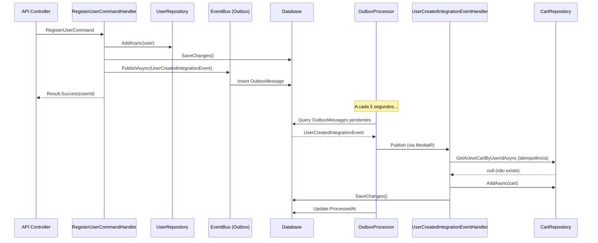

# Exemplo: Comunicação Desacoplada entre Users → Cart

> Quando um usuário é criado, o módulo Cart cria automaticamente um carrinho vazio.

---

## 🎯 Cenário

```
┌─────────────────┐                          ┌─────────────────┐
│  Users Module   │                          │   Cart Module   │
│                 │                          │                 │
│  RegisterUser   │ ─── Integration ───────► │  CreateCart     │
│  Command        │     Event               │  (automático)   │
└─────────────────┘                          └─────────────────┘
```

**Regra**: O módulo Cart **NÃO** pode referenciar diretamente o módulo Users.

---

## 📁 Estrutura de Arquivos

```
src/modules/
├── users/
│   ├── Users.Core/
│   │   └── Events/
│   │       └── UserCreatedEvent.cs          # Domain Event
│   ├── Users.Application/
│   │   └── Commands/RegisterUser/
│   │       └── RegisterUserCommandHandler.cs
│   └── Users.Contracts/                     # ✅ REFERENCIADO por Cart
│       └── Events/
│           └── UserCreatedIntegrationEvent.cs
│
└── cart/
    └── Cart.Application/
        └── IntegrationEventHandlers/
            └── UserCreatedIntegrationEventHandler.cs  # ✅ Consome o evento
```

---

## 1️⃣ Users.Contracts - Integration Event

```csharp
// Users.Contracts/Events/UserCreatedIntegrationEvent.cs
namespace Ecommerce.Modules.Users.Contracts.Events;

/// <summary>
/// Evento publicado quando um novo usuário é criado.
/// Outros módulos podem reagir a este evento.
/// </summary>
public record UserCreatedIntegrationEvent(
    Guid UserId,
    string Email,
    string? FirstName,
    string? LastName,
    DateTime CreatedAt
) : IIntegrationEvent;
```

---

## 2️⃣ Users.Core - Domain Event

```csharp
// Users.Core/Events/UserCreatedEvent.cs
namespace Ecommerce.Modules.Users.Core.Events;

/// <summary>
/// Evento de domínio interno. Não exposto a outros módulos.
/// </summary>
public record UserCreatedEvent(
    Guid UserId,
    string Email
) : IDomainEvent;
```

---

## 3️⃣ Users.Application - Command Handler

```csharp
// Users.Application/Commands/RegisterUser/RegisterUserCommand.cs
namespace Ecommerce.Modules.Users.Application.Commands.RegisterUser;

public record RegisterUserCommand(
    string Email,
    string Password,
    string? FirstName,
    string? LastName
) : ICommand<Result<Guid>>;
```

```csharp
// Users.Application/Commands/RegisterUser/RegisterUserCommandHandler.cs
using Ecommerce.Modules.Users.Contracts.Events;
using Ecommerce.Modules.Users.Core.Events;

namespace Ecommerce.Modules.Users.Application.Commands.RegisterUser;

internal sealed class RegisterUserCommandHandler 
    : ICommandHandler<RegisterUserCommand, Result<Guid>>
{
    private readonly IUserRepository _userRepository;
    private readonly IUnitOfWork _unitOfWork;
    private readonly IEventBus _eventBus;

    public RegisterUserCommandHandler(
        IUserRepository userRepository,
        IUnitOfWork unitOfWork,
        IEventBus eventBus)
    {
        _userRepository = userRepository;
        _unitOfWork = unitOfWork;
        _eventBus = eventBus;
    }

    public async Task<Result<Guid>> Handle(
        RegisterUserCommand command, 
        CancellationToken cancellationToken)
    {
        // 1. Verificar se email já existe
        var existingUser = await _userRepository.GetByEmailAsync(command.Email);
        if (existingUser is not null)
        {
            return Result.Failure<Guid>(UserErrors.EmailAlreadyExists);
        }

        // 2. Criar usuário (entidade de domínio)
        var user = User.Create(
            email: command.Email,
            passwordHash: HashPassword(command.Password),
            firstName: command.FirstName,
            lastName: command.LastName
        );

        // 3. Adicionar evento de domínio à entidade
        user.AddDomainEvent(new UserCreatedEvent(user.Id, user.Email));

        // 4. Persistir usuário
        await _userRepository.AddAsync(user, cancellationToken);
        await _unitOfWork.SaveChangesAsync(cancellationToken);

        // 5. Publicar Integration Event para outros módulos
        await _eventBus.PublishAsync(new UserCreatedIntegrationEvent(
            UserId: user.Id,
            Email: user.Email,
            FirstName: command.FirstName,
            LastName: command.LastName,
            CreatedAt: DateTime.UtcNow
        ), cancellationToken);

        return Result.Success(user.Id);
    }

    private static string HashPassword(string password)
    {
        // Implementação real usaria ASP.NET Identity
        return BCrypt.Net.BCrypt.HashPassword(password);
    }
}
```

---

## 4️⃣ Cart.Application - Integration Event Handler

```csharp
// Cart.Application/IntegrationEventHandlers/UserCreatedIntegrationEventHandler.cs
using Ecommerce.Modules.Users.Contracts.Events;  // ✅ Apenas Contracts!
using Ecommerce.Modules.Cart.Core.Entities;
using Ecommerce.Modules.Cart.Core.Repositories;

namespace Ecommerce.Modules.Cart.Application.IntegrationEventHandlers;

/// <summary>
/// Handler que reage à criação de um novo usuário.
/// Cria automaticamente um carrinho vazio para o usuário.
/// </summary>
internal sealed class UserCreatedIntegrationEventHandler 
    : IIntegrationEventHandler<UserCreatedIntegrationEvent>
{
    private readonly ICartRepository _cartRepository;
    private readonly IUnitOfWork _unitOfWork;
    private readonly ILogger<UserCreatedIntegrationEventHandler> _logger;

    public UserCreatedIntegrationEventHandler(
        ICartRepository cartRepository,
        IUnitOfWork unitOfWork,
        ILogger<UserCreatedIntegrationEventHandler> logger)
    {
        _cartRepository = cartRepository;
        _unitOfWork = unitOfWork;
        _logger = logger;
    }

    public async Task Handle(
        UserCreatedIntegrationEvent @event, 
        CancellationToken cancellationToken)
    {
        _logger.LogInformation(
            "Recebido evento UserCreated para UserId: {UserId}. Criando carrinho...",
            @event.UserId);

        // Verificar idempotência - evitar criar duplicado
        var existingCart = await _cartRepository
            .GetActiveCartByUserIdAsync(@event.UserId, cancellationToken);

        if (existingCart is not null)
        {
            _logger.LogWarning(
                "Carrinho já existe para UserId: {UserId}. Ignorando evento.",
                @event.UserId);
            return;
        }

        // Criar novo carrinho vazio
        var cart = Cart.CreateForUser(@event.UserId);

        await _cartRepository.AddAsync(cart, cancellationToken);
        await _unitOfWork.SaveChangesAsync(cancellationToken);

        _logger.LogInformation(
            "Carrinho {CartId} criado com sucesso para UserId: {UserId}",
            cart.Id,
            @event.UserId);
    }
}
```

---

## 5️⃣ Cart.Core - Entidade Cart

```csharp
// Cart.Core/Entities/Cart.cs
namespace Ecommerce.Modules.Cart.Core.Entities;

public class Cart : AggregateRoot
{
    public Guid? UserId { get; private set; }
    public string? SessionId { get; private set; }
    public CartStatus Status { get; private set; }
    
    private readonly List<CartItem> _items = new();
    public IReadOnlyCollection<CartItem> Items => _items.AsReadOnly();

    private Cart() { } // EF Core

    /// <summary>
    /// Cria um carrinho associado a um usuário logado.
    /// </summary>
    public static Cart CreateForUser(Guid userId)
    {
        var cart = new Cart
        {
            Id = Guid.NewGuid(),
            UserId = userId,
            SessionId = null,
            Status = CartStatus.Active,
            CreatedAt = DateTime.UtcNow,
            UpdatedAt = DateTime.UtcNow
        };

        cart.AddDomainEvent(new CartCreatedEvent(cart.Id, userId, null));

        return cart;
    }

    /// <summary>
    /// Cria um carrinho para usuário anônimo (sessão).
    /// </summary>
    public static Cart CreateForSession(string sessionId)
    {
        var cart = new Cart
        {
            Id = Guid.NewGuid(),
            UserId = null,
            SessionId = sessionId,
            Status = CartStatus.Active,
            CreatedAt = DateTime.UtcNow,
            UpdatedAt = DateTime.UtcNow
        };

        cart.AddDomainEvent(new CartCreatedEvent(cart.Id, null, sessionId));

        return cart;
    }
}
```

---

## 6️⃣ Infrastructure - Event Bus (Outbox Pattern)

```csharp
// BuildingBlocks.Infrastructure/EventBus/OutboxEventBus.cs
namespace Ecommerce.BuildingBlocks.Infrastructure.EventBus;

public class OutboxEventBus : IEventBus
{
    private readonly DbContext _dbContext;
    private readonly ILogger<OutboxEventBus> _logger;

    public OutboxEventBus(DbContext dbContext, ILogger<OutboxEventBus> logger)
    {
        _dbContext = dbContext;
        _logger = logger;
    }

    public async Task PublishAsync<TEvent>(
        TEvent integrationEvent, 
        CancellationToken cancellationToken = default) 
        where TEvent : IIntegrationEvent
    {
        var outboxMessage = new OutboxMessage
        {
            Id = Guid.NewGuid(),
            EventType = typeof(TEvent).AssemblyQualifiedName!,
            Payload = JsonSerializer.Serialize(integrationEvent),
            OccurredAt = DateTime.UtcNow,
            ProcessedAt = null
        };

        _dbContext.Set<OutboxMessage>().Add(outboxMessage);
        await _dbContext.SaveChangesAsync(cancellationToken);

        _logger.LogInformation(
            "Integration event {EventType} salvo no Outbox. Id: {MessageId}",
            typeof(TEvent).Name,
            outboxMessage.Id);
    }
}
```

```csharp
// BuildingBlocks.Infrastructure/BackgroundJobs/ProcessOutboxMessagesJob.cs
namespace Ecommerce.BuildingBlocks.Infrastructure.BackgroundJobs;

public class ProcessOutboxMessagesJob : BackgroundService
{
    private readonly IServiceProvider _serviceProvider;
    private readonly ILogger<ProcessOutboxMessagesJob> _logger;
    private readonly TimeSpan _pollingInterval = TimeSpan.FromSeconds(5);

    public ProcessOutboxMessagesJob(
        IServiceProvider serviceProvider,
        ILogger<ProcessOutboxMessagesJob> logger)
    {
        _serviceProvider = serviceProvider;
        _logger = logger;
    }

    protected override async Task ExecuteAsync(CancellationToken stoppingToken)
    {
        while (!stoppingToken.IsCancellationRequested)
        {
            await ProcessPendingMessages(stoppingToken);
            await Task.Delay(_pollingInterval, stoppingToken);
        }
    }

    private async Task ProcessPendingMessages(CancellationToken cancellationToken)
    {
        using var scope = _serviceProvider.CreateScope();
        var dbContext = scope.ServiceProvider.GetRequiredService<DbContext>();
        var mediator = scope.ServiceProvider.GetRequiredService<IMediator>();

        var pendingMessages = await dbContext
            .Set<OutboxMessage>()
            .Where(m => m.ProcessedAt == null)
            .OrderBy(m => m.OccurredAt)
            .Take(20)
            .ToListAsync(cancellationToken);

        foreach (var message in pendingMessages)
        {
            try
            {
                var eventType = Type.GetType(message.EventType);
                if (eventType is null)
                {
                    _logger.LogWarning(
                        "Tipo de evento não encontrado: {EventType}",
                        message.EventType);
                    continue;
                }

                var @event = JsonSerializer.Deserialize(message.Payload, eventType);

                // Publicar para todos os handlers registrados
                await mediator.Publish(@event!, cancellationToken);

                // Marcar como processado
                message.ProcessedAt = DateTime.UtcNow;
                await dbContext.SaveChangesAsync(cancellationToken);

                _logger.LogInformation(
                    "Mensagem {MessageId} processada com sucesso",
                    message.Id);
            }
            catch (Exception ex)
            {
                _logger.LogError(ex,
                    "Erro ao processar mensagem {MessageId}",
                    message.Id);
                
                message.RetryCount++;
                message.ErrorMessage = ex.Message;
                await dbContext.SaveChangesAsync(cancellationToken);
            }
        }
    }
}
```

---

## 7️⃣ Registro de Dependências

```csharp
// Cart.Infrastructure/DependencyInjection.cs
namespace Ecommerce.Modules.Cart.Infrastructure;

public static class DependencyInjection
{
    public static IServiceCollection AddCartModule(
        this IServiceCollection services,
        IConfiguration configuration)
    {
        // DbContext
        services.AddDbContext<CartDbContext>(options =>
            options.UseNpgsql(
                configuration.GetConnectionString("DefaultConnection"),
                b => b.MigrationsHistoryTable("__EFMigrationsHistory", "cart")
            ));

        // Repositories
        services.AddScoped<ICartRepository, CartRepository>();

        // MediatR registra automaticamente os handlers
        // via RegisterServicesFromAssembly no Program.cs

        return services;
    }
}
```

```csharp
// Program.cs (API)
var builder = WebApplication.CreateBuilder(args);

// Módulos
builder.Services.AddUsersModule(builder.Configuration);
builder.Services.AddCartModule(builder.Configuration);

// MediatR - registrar todos os assemblies
builder.Services.AddMediatR(cfg =>
{
    cfg.RegisterServicesFromAssembly(typeof(Users.Application.AssemblyReference).Assembly);
    cfg.RegisterServicesFromAssembly(typeof(Cart.Application.AssemblyReference).Assembly);
});

// Background Job para processar Outbox
builder.Services.AddHostedService<ProcessOutboxMessagesJob>();
```

---

## 🔄 Fluxo Completo



---

## ✅ Benefícios da Abordagem

| Aspecto | Benefício |
|---------|-----------|
| **Desacoplamento** | Cart não conhece Users.Core nem Users.Application |
| **Contrato Estável** | Apenas Users.Contracts é exposto |
| **Resiliência** | Outbox Pattern garante entrega eventual |
| **Idempotência** | Handler verifica se carrinho já existe |
| **Testabilidade** | Fácil mockar IEventBus nos testes |
| **Evolução** | Fácil migrar para message broker (RabbitMQ) |

---

## 🧪 Teste Unitário

```csharp
public class UserCreatedIntegrationEventHandlerTests
{
    [Fact]
    public async Task Handle_WhenCartDoesNotExist_ShouldCreateCart()
    {
        // Arrange
        var cartRepository = new Mock<ICartRepository>();
        var unitOfWork = new Mock<IUnitOfWork>();
        var logger = new Mock<ILogger<UserCreatedIntegrationEventHandler>>();

        cartRepository
            .Setup(x => x.GetActiveCartByUserIdAsync(It.IsAny<Guid>(), default))
            .ReturnsAsync((Cart?)null);

        var handler = new UserCreatedIntegrationEventHandler(
            cartRepository.Object,
            unitOfWork.Object,
            logger.Object);

        var @event = new UserCreatedIntegrationEvent(
            UserId: Guid.NewGuid(),
            Email: "test@example.com",
            FirstName: "Test",
            LastName: "User",
            CreatedAt: DateTime.UtcNow);

        // Act
        await handler.Handle(@event, CancellationToken.None);

        // Assert
        cartRepository.Verify(
            x => x.AddAsync(It.IsAny<Cart>(), default),
            Times.Once);
        unitOfWork.Verify(
            x => x.SaveChangesAsync(default),
            Times.Once);
    }

    [Fact]
    public async Task Handle_WhenCartAlreadyExists_ShouldNotCreateDuplicate()
    {
        // Arrange
        var existingCart = Cart.CreateForUser(Guid.NewGuid());
        var cartRepository = new Mock<ICartRepository>();
        var unitOfWork = new Mock<IUnitOfWork>();
        var logger = new Mock<ILogger<UserCreatedIntegrationEventHandler>>();

        cartRepository
            .Setup(x => x.GetActiveCartByUserIdAsync(It.IsAny<Guid>(), default))
            .ReturnsAsync(existingCart);

        var handler = new UserCreatedIntegrationEventHandler(
            cartRepository.Object,
            unitOfWork.Object,
            logger.Object);

        var @event = new UserCreatedIntegrationEvent(
            UserId: existingCart.UserId!.Value,
            Email: "test@example.com",
            FirstName: "Test",
            LastName: "User",
            CreatedAt: DateTime.UtcNow);

        // Act
        await handler.Handle(@event, CancellationToken.None);

        // Assert
        cartRepository.Verify(
            x => x.AddAsync(It.IsAny<Cart>(), default),
            Times.Never);
    }
}
```

---

**Última atualização**: 2025-12-13
