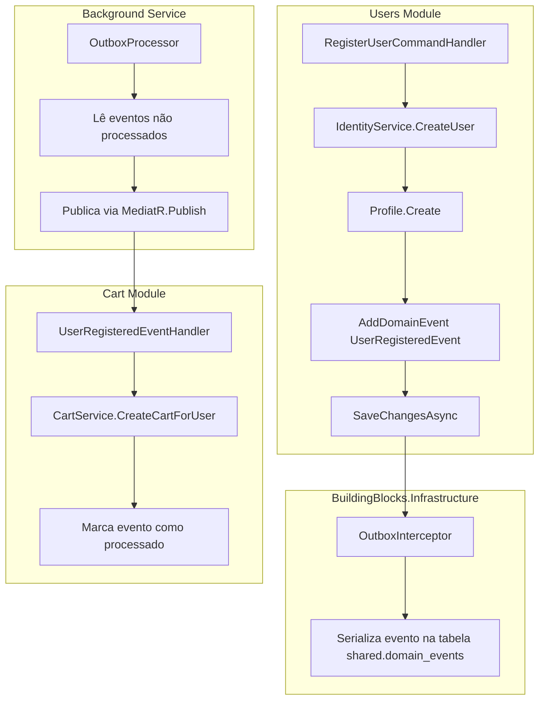

# Integração Entre Módulos SEM RabbitMQ

Este documento descreve como implementar a integração entre os módulos **Users** e **Cart** utilizando **MediatR in-process** com o padrão **Outbox** para garantir consistência eventual, sem necessidade de um message broker externo como RabbitMQ.

## Cenário

1. Usuário é criado via ASP.NET Identity
2. Perfil do usuário é criado
3. Evento de domínio `UserRegisteredEvent` é disparado
4. Módulo Cart escuta o evento e cria um carrinho para o usuário
5. **Módulos Users e Cart não se conhecem diretamente**

---

## Arquitetura



---

## Componentes Necessários

### 1. Evento de Integração (Shared/Contracts)

Crie um projeto **Contracts** ou use uma pasta em BuildingBlocks para eventos compartilhados:

```csharp
// src/building-blocks/BuildingBlocks.Contracts/Events/UserRegisteredIntegrationEvent.cs
namespace BuildingBlocks.Contracts.Events;

/// <summary>
/// Evento de integração disparado quando um usuário é registrado.
/// Este evento é compartilhado entre módulos - NÃO contém lógica de domínio.
/// </summary>
public record UserRegisteredIntegrationEvent(
    Guid UserId,
    string Email,
    string? FirstName,
    string? LastName,
    DateTime RegisteredAt
) : IIntegrationEvent;
```

### 2. Interface de Evento de Integração

```csharp
// src/building-blocks/BuildingBlocks.Messaging/Abstractions/IIntegrationEvent.cs
using MediatR;

namespace BuildingBlocks.Messaging.Abstractions;

/// <summary>
/// Interface marcadora para eventos de integração entre módulos.
/// Diferente de IDomainEvent, estes eventos são publicados APÓS o commit da transação.
/// </summary>
public interface IIntegrationEvent : INotification
{
    Guid Id => Guid.NewGuid();
    DateTime OccurredOn => DateTime.UtcNow;
}
```

---

## Implementação Passo a Passo

### Passo 1: Evento de Domínio no Módulo Users

```csharp
// src/modules/users/Users.Domain/Events/UserRegisteredDomainEvent.cs
using BuildingBlocks.Domain.Events;

namespace Users.Domain.Events;

public record UserRegisteredDomainEvent(
    Guid UserId,
    string Email,
    string? FirstName,
    string? LastName
) : DomainEvent;
```

### Passo 2: Aggregate Root dispara o evento

```csharp
// src/modules/users/Users.Domain/Aggregates/Profile.cs
public class Profile : AggregateRoot
{
    public Guid UserId { get; private set; }
    public string? FirstName { get; private set; }
    public string? LastName { get; private set; }
    // ... outras propriedades
    
    public static Profile Create(Guid userId, string email, string? firstName, string? lastName)
    {
        var profile = new Profile
        {
            Id = Guid.NewGuid(),
            UserId = userId,
            FirstName = firstName,
            LastName = lastName
        };
        
        // Dispara evento de domínio
        profile.AddDomainEvent(new UserRegisteredDomainEvent(
            userId, 
            email, 
            firstName, 
            lastName
        ));
        
        return profile;
    }
}
```

### Passo 3: Outbox Interceptor captura eventos

```csharp
// src/building-blocks/BuildingBlocks.Infrastructure/Persistence/Interceptors/OutboxInterceptor.cs
using BuildingBlocks.Domain.Models;
using BuildingBlocks.Infrastructure.Persistence.Outbox;
using Microsoft.EntityFrameworkCore;
using Microsoft.EntityFrameworkCore.Diagnostics;
using System.Text.Json;

namespace BuildingBlocks.Infrastructure.Persistence.Interceptors;

public class OutboxInterceptor : SaveChangesInterceptor
{
    public override async ValueTask<InterceptionResult<int>> SavingChangesAsync(
        DbContextEventData eventData,
        InterceptionResult<int> result,
        CancellationToken cancellationToken = default)
    {
        var dbContext = eventData.Context;
        if (dbContext is null) return result;

        // Coleta todos os eventos de domínio dos aggregates modificados
        var aggregatesWithEvents = dbContext.ChangeTracker
            .Entries<IAggregateRoot>()
            .Where(e => e.Entity.DomainEvents.Any())
            .Select(e => e.Entity)
            .ToList();

        var domainEvents = aggregatesWithEvents
            .SelectMany(a => a.DomainEvents)
            .ToList();

        // Converte eventos em OutboxMessages
        foreach (var domainEvent in domainEvents)
        {
            var outboxMessage = new OutboxMessage
            {
                Id = Guid.NewGuid(),
                Module = GetModuleName(domainEvent),
                AggregateType = domainEvent.GetType().DeclaringType?.Name ?? "Unknown",
                AggregateId = GetAggregateId(domainEvent),
                EventType = domainEvent.GetType().AssemblyQualifiedName!,
                Payload = JsonSerializer.Serialize(domainEvent, domainEvent.GetType()),
                CreatedAt = DateTime.UtcNow
            };

            dbContext.Set<OutboxMessage>().Add(outboxMessage);
        }

        // Limpa eventos dos aggregates
        foreach (var aggregate in aggregatesWithEvents)
        {
            aggregate.ClearDomainEvents();
        }

        return result;
    }

    private static string GetModuleName(object domainEvent)
    {
        var ns = domainEvent.GetType().Namespace ?? "";
        if (ns.Contains("Users")) return "users";
        if (ns.Contains("Cart")) return "cart";
        if (ns.Contains("Catalog")) return "catalog";
        if (ns.Contains("Orders")) return "orders";
        if (ns.Contains("Payments")) return "payments";
        if (ns.Contains("Coupons")) return "coupons";
        return "unknown";
    }

    private static Guid GetAggregateId(object domainEvent)
    {
        // Tenta extrair o ID do evento via reflection
        var prop = domainEvent.GetType().GetProperty("UserId") 
                ?? domainEvent.GetType().GetProperty("Id");
        return prop?.GetValue(domainEvent) as Guid? ?? Guid.Empty;
    }
}
```

### Passo 4: Outbox Message Entity

```csharp
// src/building-blocks/BuildingBlocks.Infrastructure/Persistence/Outbox/OutboxMessage.cs
namespace BuildingBlocks.Infrastructure.Persistence.Outbox;

/// <summary>
/// Representa um evento pendente na tabela shared.domain_events
/// </summary>
public class OutboxMessage
{
    public Guid Id { get; set; }
    public string Module { get; set; } = default!;
    public string AggregateType { get; set; } = default!;
    public Guid AggregateId { get; set; }
    public string EventType { get; set; } = default!;
    public string Payload { get; set; } = default!;
    public DateTime CreatedAt { get; set; }
    public DateTime? ProcessedAt { get; set; }
    public string? ErrorMessage { get; set; }
    public int RetryCount { get; set; }
}
```

### Passo 5: Background Service para processar Outbox

```csharp
// src/building-blocks/BuildingBlocks.Infrastructure/BackgroundServices/OutboxProcessor.cs
using BuildingBlocks.Infrastructure.Persistence.Outbox;
using MediatR;
using Microsoft.EntityFrameworkCore;
using Microsoft.Extensions.DependencyInjection;
using Microsoft.Extensions.Hosting;
using Microsoft.Extensions.Logging;
using System.Text.Json;

namespace BuildingBlocks.Infrastructure.BackgroundServices;

public class OutboxProcessor : BackgroundService
{
    private readonly IServiceScopeFactory _scopeFactory;
    private readonly ILogger<OutboxProcessor> _logger;
    private readonly TimeSpan _pollingInterval = TimeSpan.FromSeconds(5);

    public OutboxProcessor(
        IServiceScopeFactory scopeFactory,
        ILogger<OutboxProcessor> logger)
    {
        _scopeFactory = scopeFactory;
        _logger = logger;
    }

    protected override async Task ExecuteAsync(CancellationToken stoppingToken)
    {
        while (!stoppingToken.IsCancellationRequested)
        {
            try
            {
                await ProcessOutboxMessagesAsync(stoppingToken);
            }
            catch (Exception ex)
            {
                _logger.LogError(ex, "Error processing outbox messages");
            }

            await Task.Delay(_pollingInterval, stoppingToken);
        }
    }

    private async Task ProcessOutboxMessagesAsync(CancellationToken cancellationToken)
    {
        using var scope = _scopeFactory.CreateScope();
        var dbContext = scope.ServiceProvider.GetRequiredService<DbContext>();
        var mediator = scope.ServiceProvider.GetRequiredService<IMediator>();

        // Busca mensagens não processadas (com lock para evitar duplicação)
        var messages = await dbContext.Set<OutboxMessage>()
            .Where(m => m.ProcessedAt == null && m.RetryCount < 3)
            .OrderBy(m => m.CreatedAt)
            .Take(20)
            .ToListAsync(cancellationToken);

        foreach (var message in messages)
        {
            try
            {
                // Deserializa o evento
                var eventType = Type.GetType(message.EventType);
                if (eventType is null)
                {
                    _logger.LogWarning("Event type not found: {EventType}", message.EventType);
                    message.ErrorMessage = $"Event type not found: {message.EventType}";
                    message.RetryCount++;
                    continue;
                }

                var domainEvent = JsonSerializer.Deserialize(message.Payload, eventType);
                if (domainEvent is null) continue;

                // Publica o evento via MediatR (in-process)
                await mediator.Publish(domainEvent, cancellationToken);

                // Marca como processado
                message.ProcessedAt = DateTime.UtcNow;
                _logger.LogInformation(
                    "Processed outbox message {MessageId} of type {EventType}",
                    message.Id, 
                    eventType.Name);
            }
            catch (Exception ex)
            {
                _logger.LogError(ex, "Error processing outbox message {MessageId}", message.Id);
                message.ErrorMessage = ex.Message;
                message.RetryCount++;
            }
        }

        await dbContext.SaveChangesAsync(cancellationToken);
    }
}
```

### Passo 6: Handler no Módulo Cart

```csharp
// src/modules/cart/Cart.Application/EventHandlers/UserRegisteredEventHandler.cs
using BuildingBlocks.Contracts.Events;
using Cart.Domain.Aggregates;
using Cart.Domain.Repositories;
using MediatR;
using Microsoft.Extensions.Logging;

namespace Cart.Application.EventHandlers;

/// <summary>
/// Handler que escuta o evento de usuário registrado e cria um carrinho.
/// Este handler NÃO conhece o módulo Users - apenas o contrato do evento.
/// </summary>
public class UserRegisteredEventHandler : INotificationHandler<UserRegisteredIntegrationEvent>
{
    private readonly ICartRepository _cartRepository;
    private readonly ILogger<UserRegisteredEventHandler> _logger;

    public UserRegisteredEventHandler(
        ICartRepository cartRepository,
        ILogger<UserRegisteredEventHandler> logger)
    {
        _cartRepository = cartRepository;
        _logger = logger;
    }

    public async Task Handle(
        UserRegisteredIntegrationEvent notification, 
        CancellationToken cancellationToken)
    {
        _logger.LogInformation(
            "Creating cart for newly registered user {UserId}", 
            notification.UserId);

        // Verifica se já existe um carrinho para este usuário (idempotência)
        var existingCart = await _cartRepository.GetByUserIdAsync(
            notification.UserId, 
            cancellationToken);
            
        if (existingCart is not null)
        {
            _logger.LogWarning(
                "Cart already exists for user {UserId}, skipping creation", 
                notification.UserId);
            return;
        }

        // Cria o carrinho
        var cart = ShoppingCart.CreateForUser(notification.UserId);
        
        await _cartRepository.AddAsync(cart, cancellationToken);
        await _cartRepository.UnitOfWork.SaveChangesAsync(cancellationToken);

        _logger.LogInformation(
            "Cart {CartId} created for user {UserId}", 
            cart.Id, 
            notification.UserId);
    }
}
```

### Passo 7: Conversão de Evento de Domínio para Evento de Integração

```csharp
// src/modules/users/Users.Application/EventHandlers/UserRegisteredDomainEventHandler.cs
using BuildingBlocks.Contracts.Events;
using BuildingBlocks.Messaging.Abstractions;
using MediatR;
using Users.Domain.Events;

namespace Users.Application.EventHandlers;

/// <summary>
/// Converte o evento de domínio interno em evento de integração.
/// Isso permite que o módulo Users controle quais informações são expostas.
/// </summary>
public class UserRegisteredDomainEventHandler : INotificationHandler<UserRegisteredDomainEvent>
{
    private readonly IEventBus _eventBus;

    public UserRegisteredDomainEventHandler(IEventBus eventBus)
    {
        _eventBus = eventBus;
    }

    public async Task Handle(
        UserRegisteredDomainEvent notification, 
        CancellationToken cancellationToken)
    {
        // Converte para evento de integração
        var integrationEvent = new UserRegisteredIntegrationEvent(
            notification.UserId,
            notification.Email,
            notification.FirstName,
            notification.LastName,
            notification.OccurredOn
        );

        // Publica para outros módulos
        await _eventBus.PublishAsync(integrationEvent, cancellationToken);
    }
}
```

### Passo 8: Implementação In-Memory do Event Bus

```csharp
// src/building-blocks/BuildingBlocks.Messaging/Implementation/InMemoryEventBus.cs
using BuildingBlocks.Messaging.Abstractions;
using MediatR;

namespace BuildingBlocks.Messaging.Implementation;

/// <summary>
/// Implementação in-memory do Event Bus usando MediatR.
/// Ideal para desenvolvimento local e testes.
/// </summary>
public class InMemoryEventBus : IEventBus
{
    private readonly IMediator _mediator;

    public InMemoryEventBus(IMediator mediator)
    {
        _mediator = mediator;
    }

    public async Task PublishAsync<TEvent>(TEvent @event, CancellationToken cancellationToken = default)
        where TEvent : IIntegrationEvent
    {
        await _mediator.Publish(@event, cancellationToken);
    }
}
```

---

## Estrutura de Dependências

```
┌─────────────────────────────────────────────────────────────┐
│                    BuildingBlocks.Contracts                  │
│    (Eventos de Integração compartilhados entre módulos)      │
└─────────────────────────────────────────────────────────────┘
                              ▲
                              │
         ┌────────────────────┼────────────────────┐
         │                    │                    │
         ▼                    │                    ▼
┌─────────────────┐           │           ┌─────────────────┐
│  Users.Domain   │           │           │   Cart.Domain   │
│ (Eventos de     │           │           │  (Aggregates)   │
│  Domínio)       │           │           │                 │
└────────┬────────┘           │           └────────┬────────┘
         │                    │                    │
         ▼                    │                    ▼
┌─────────────────┐           │           ┌─────────────────┐
│Users.Application│           │           │Cart.Application │
│ (Handlers -     │───────────┘           │ (Handlers -     │
│  Converte para  │                       │  Cria carrinho) │
│  Integration)   │                       │                 │
└─────────────────┘                       └─────────────────┘

❌ Users NÃO referencia Cart
❌ Cart NÃO referencia Users
✅ Ambos referenciam BuildingBlocks.Contracts
```

---

## Fluxo de Execução

```
1. [API] POST /api/users/register
      │
      ▼
2. [Users.Application] RegisterUserCommandHandler
      │
      ├── Cria usuário no Identity
      ├── Cria Profile (AggregateRoot)
      ├── Profile.AddDomainEvent(UserRegisteredDomainEvent)
      │
      ▼
3. [Users.Infrastructure] SaveChangesAsync()
      │
      ├── OutboxInterceptor captura evento
      ├── Serializa em shared.domain_events
      │
      ▼
4. [Transaction COMMIT]
      │
      ▼
5. [BackgroundService] OutboxProcessor (a cada 5 segundos)
      │
      ├── Lê eventos não processados
      ├── Deserializa UserRegisteredDomainEvent
      ├── MediatR.Publish(evento)
      │
      ▼
6. [Users.Application] UserRegisteredDomainEventHandler
      │
      ├── Converte para UserRegisteredIntegrationEvent
      ├── IEventBus.PublishAsync()
      │
      ▼
7. [Cart.Application] UserRegisteredEventHandler
      │
      ├── Cria ShoppingCart.CreateForUser(userId)
      ├── SaveChangesAsync()
      │
      ▼
8. [BackgroundService] Marca OutboxMessage como processado
```

---

## Vantagens desta Abordagem

| Vantagem | Descrição |
|----------|-----------|
| **Simplicidade** | Não requer infraestrutura externa (RabbitMQ, Redis, etc.) |
| **Consistência** | Outbox pattern garante que eventos não são perdidos |
| **Transacional** | Evento só é publicado após commit bem-sucedido |
| **Idempotência** | Handler pode verificar se ação já foi executada |
| **Testabilidade** | Fácil de testar com MediatR in-memory |
| **Desacoplamento** | Módulos comunicam apenas via contratos |

---

## Desvantagens

| Desvantagem | Mitigação |
|-------------|-----------|
| **Polling** | Latência de até 5s (configurável) |
| **Single Process** | Não escala para múltiplas instâncias sem lock distribuído |
| **Retry limitado** | Implementar Dead Letter Queue manual |

---

## Configuração de DI

```csharp
// Program.cs ou DependencyInjection.cs
services.AddMediatR(cfg => {
    cfg.RegisterServicesFromAssemblies(
        typeof(Users.Application.AssemblyReference).Assembly,
        typeof(Cart.Application.AssemblyReference).Assembly
    );
});

services.AddScoped<IEventBus, InMemoryEventBus>();
services.AddHostedService<OutboxProcessor>();
```

---

## Tabela do Banco de Dados

```sql
-- shared.domain_events (Outbox)
CREATE TABLE shared.domain_events (
    id UUID PRIMARY KEY,
    module VARCHAR(50) NOT NULL,
    aggregate_type VARCHAR(100) NOT NULL,
    aggregate_id UUID NOT NULL,
    event_type VARCHAR(500) NOT NULL,
    payload JSONB NOT NULL,
    created_at TIMESTAMPTZ NOT NULL DEFAULT NOW(),
    processed_at TIMESTAMPTZ,
    error_message TEXT,
    retry_count INT DEFAULT 0
);

CREATE INDEX idx_domain_events_unprocessed 
ON shared.domain_events(created_at) 
WHERE processed_at IS NULL;
```
