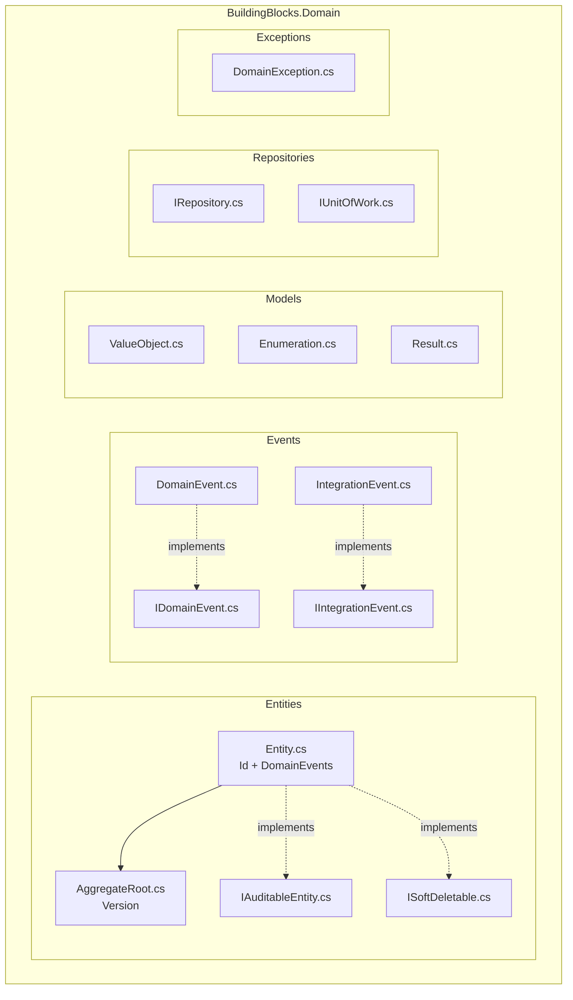
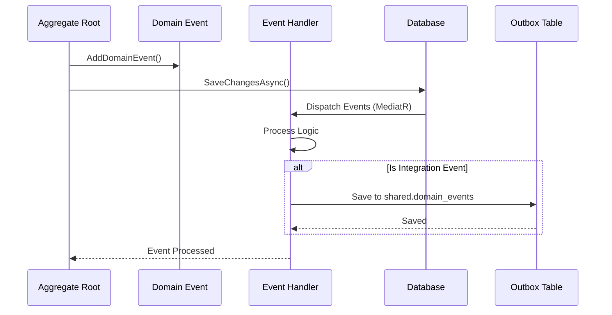
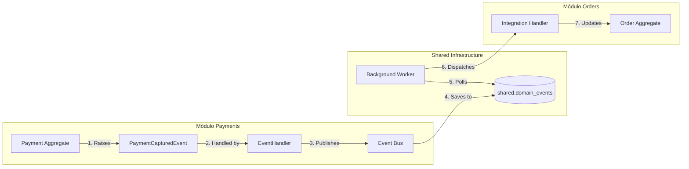
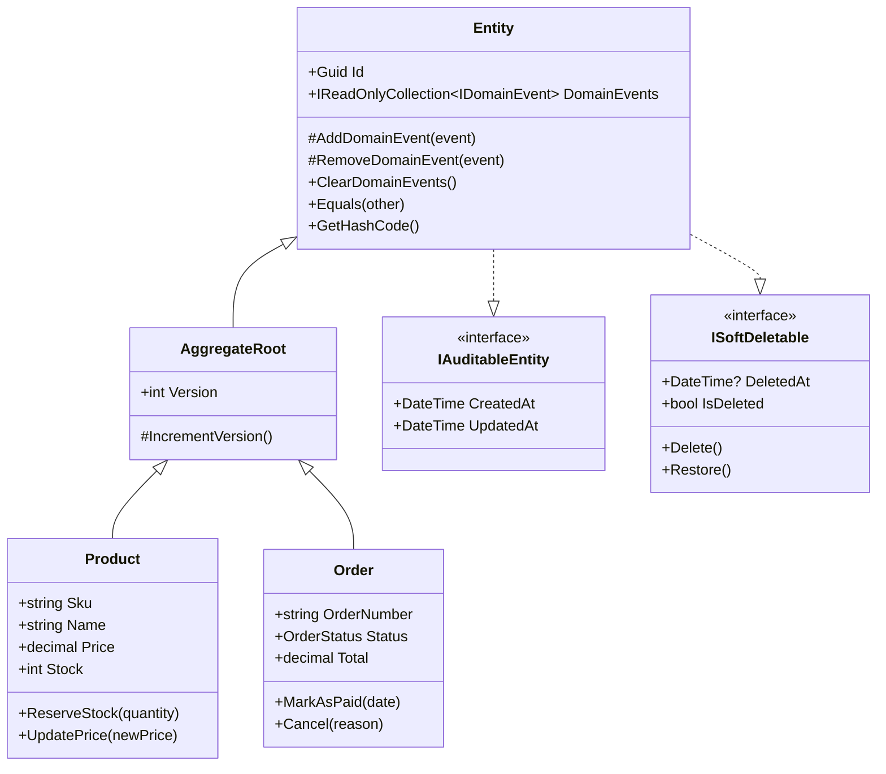
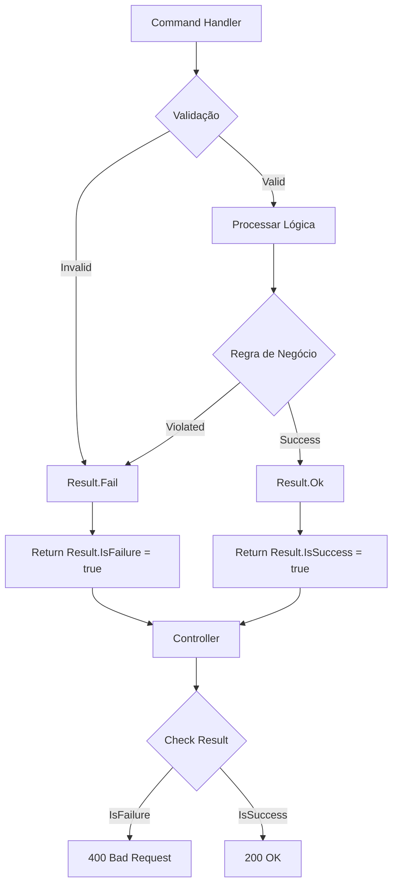
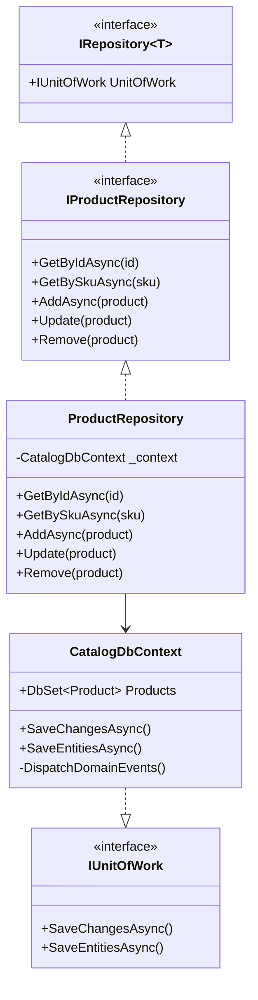
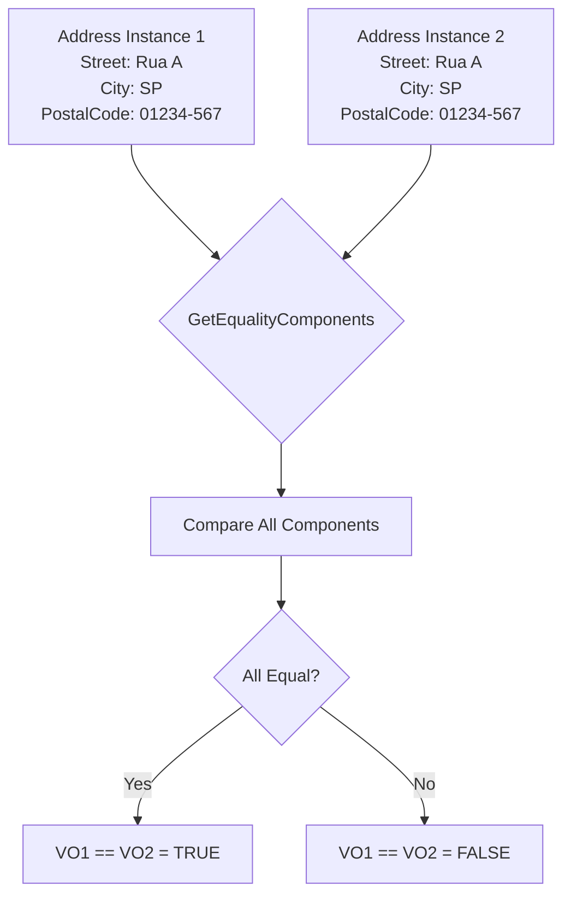
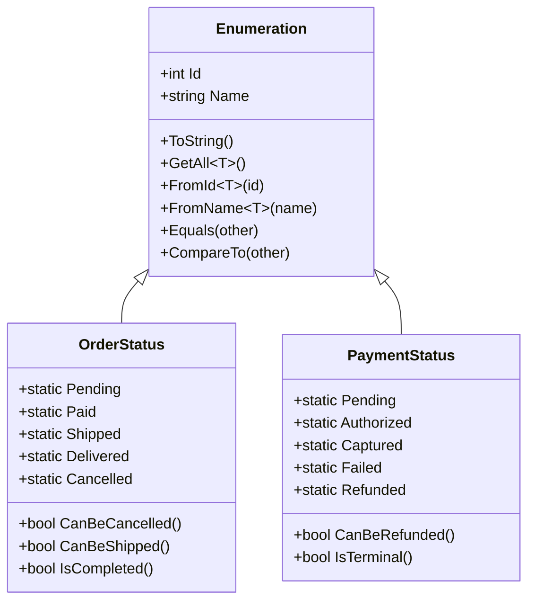
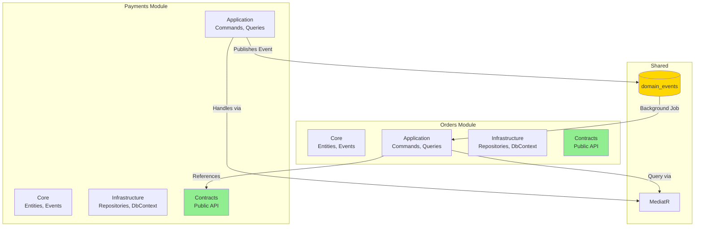
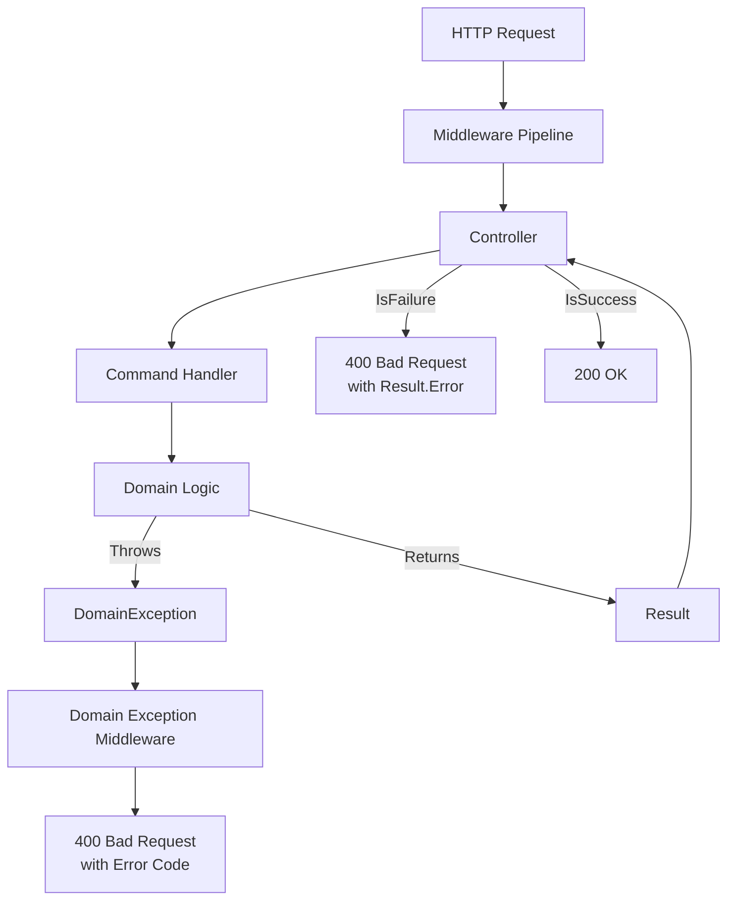

# Diagramas de Arquitetura - BuildingBlocks.Domain

## 1. Visão Geral da Estrutura

## 2. Fluxo de Domain Events

## 3. Fluxo de Integration Events (Entre Módulos)

## 4. Hierarchy de Entities

## 5. Result Pattern Flow

## 6. Repository Pattern

## 7. Value Object Equality

## 8. Smart Enum Pattern

## 9. Modular Monolith Communication

## 10. Exception Handling Flow

---

## Legenda

- 🟢 **Verde**: Contratos públicos (podem ser referenciados por outros módulos)
- 🟡 **Amarelo**: Infraestrutura compartilhada
- 🔵 **Azul**: Componentes internos de módulo
- ➡️ **Setas sólidas**: Dependências diretas
- ⋯➡️ **Setas pontilhadas**: Implements/Uses

---

**Versão**: 1.0.0  
**Data**: 2025-12-13
